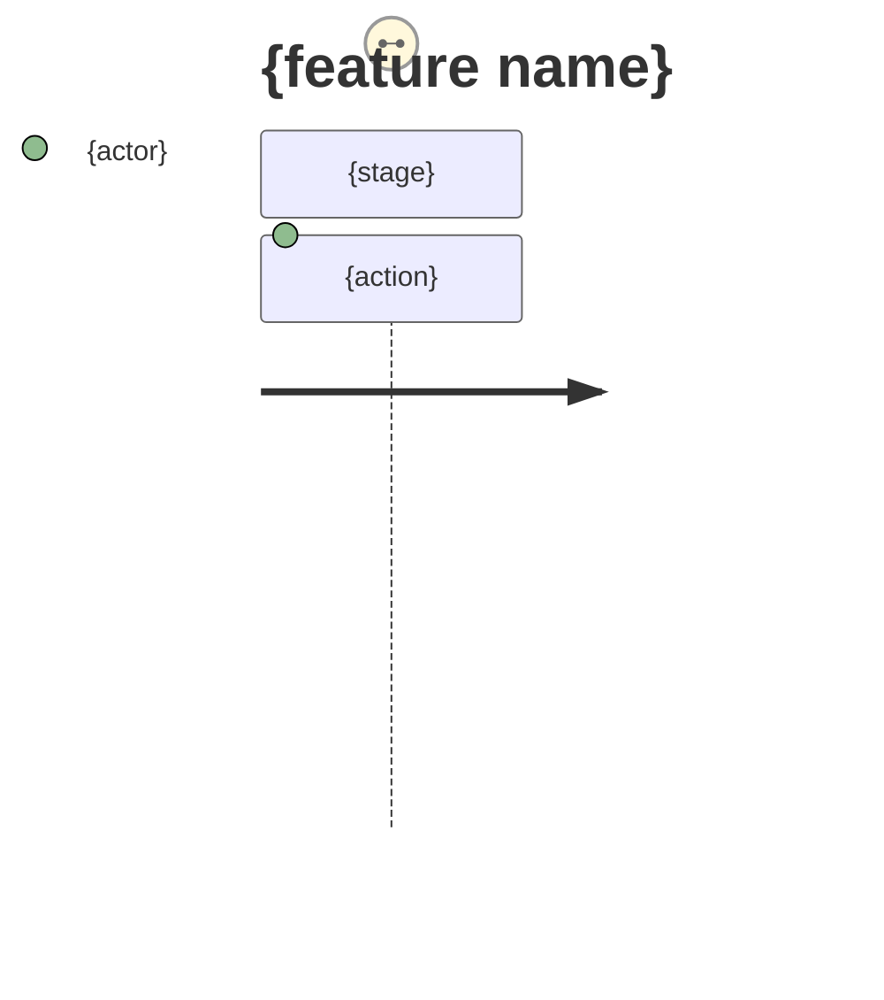
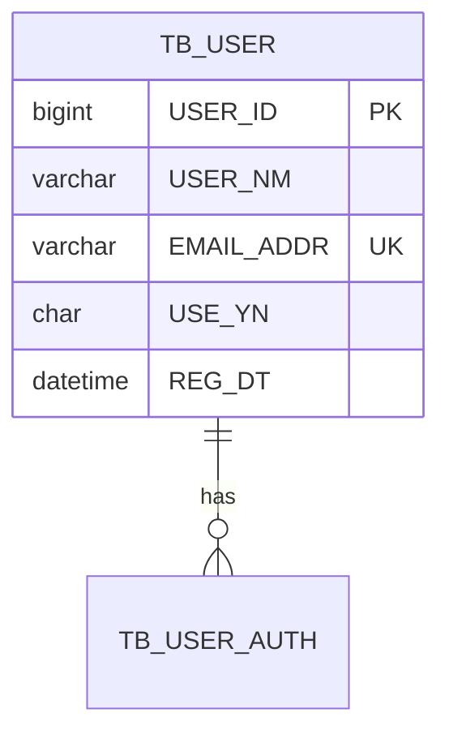
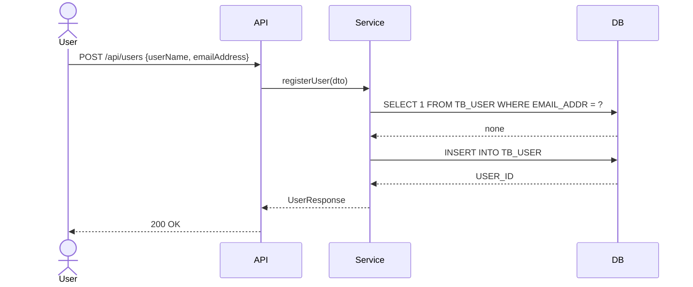
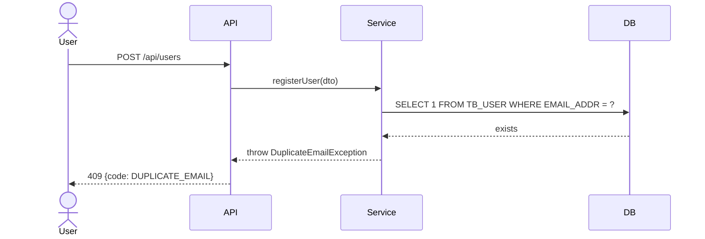

# Blueprint Skeleton (10 standard sections)

Template instantiated by `/blueprint` Step 2. Replace every `{…}` placeholder with `{feature}` content derived from planner deliverables; fill non-derivable portions with conservative defaults and leave a `❓ Additional information needed` marker where planner input is required.

The example values below (`TB_USER`, `POST /api/users`, `registerUser`) are illustrative — swap them for the actual feature. Pseudocode in Section 6 MUST use the ` ```pseudo ` tag; a real language tag (`java`, `typescript`) causes it to be misread as implementation code.

## Table of contents

- Section 1 — Overview (Purpose · Background · Scope · Success Metrics/KPI)
- Section 2 — Functional Spec (Actors · User Journey · Business Rules)
- Section 3 — Data Model (ER Diagram · DDL · Index Strategy · FK Relations)
- Section 4 — API Contract (Endpoint List · Request/Response Schemas · Error Codes)
- Section 5 — Sequence Diagrams (Happy Path · Error Path)
- Section 6 — Business Logic Design (pseudocode only)
- Section 7 — Error Handling Policy
- Section 8 — Non-Functional Requirements (Performance · Security · Availability)
- Section 9 — Test Strategy Overview (levels · required test cases)
- Section 10 — HITL Triggers (firing principles · feature-specific triggers · question rules · anti-HITL)

---

# Blueprint: {feature name}

> **Generated by**: `/blueprint` skill v2 (worktree-first)
> **Planner Source**: {PLANNER_DIR or "direct input"}
> **Sprint Branch**: {SPRINT_BRANCH}
> **Status**: Draft (awaiting blueprint-reviewer verification)

## 1. Overview

### 1.1 Purpose
{the user/business problem this feature solves — pain point from interview-report.md}

### 1.2 Background
{why this feature is needed now — market signal from market-analysis.md}

### 1.3 Scope
- **In Scope**:
  - {story map items from feature-definition.md}
- **Out of Scope**:
  - {items explicitly split out to a later sprint or a separate feature}

### 1.4 Success Metrics (KPI)
| Metric | Target | Measurement |
|--------|--------|-------------|
| {KPI from requirements-definition.md} | {target value} | {measurement method} |

## 2. Functional Spec

### 2.1 Actors
{actors from usecase-definition.md — user types, systems, external systems}

### 2.2 User Scenario (Mermaid User Journey)



### 2.3 Business Rules
| ID | Rule | Source |
|----|------|--------|
| BR-01 | {e.g., "duplicate sign-up by the same email is not allowed"} | {requirements-definition.md item number} |

## 3. Data Model

### 3.1 ER Diagram



### 3.2 Table Definitions (DDL)

> **Korean public data standard**: every table follows the `TB_`/`TC_`/`TH_`/`TL_`/`TR_` prefix and every column follows the `_YMD`/`_DT`/`_AMT`/`_NM`/`_CD`/`_NO`/`_CN`/`_YN`/`_SN`/`_ADDR` suffix rules. The `data-standard` auto-skill validates this at Write time.

```sql
-- TB_USER: user master
CREATE TABLE TB_USER (
  USER_ID     BIGINT       NOT NULL AUTO_INCREMENT COMMENT 'User ID',
  USER_NM     VARCHAR(50)  NOT NULL COMMENT 'User name',
  EMAIL_ADDR  VARCHAR(255) NOT NULL COMMENT 'Email address',
  USE_YN      CHAR(1)      NOT NULL DEFAULT 'Y' COMMENT 'Use flag',
  REG_DT      DATETIME     NOT NULL DEFAULT CURRENT_TIMESTAMP COMMENT 'Registration datetime',
  PRIMARY KEY (USER_ID),
  UNIQUE KEY UK_USER_EMAIL (EMAIL_ADDR)
);
```

### 3.3 Index Strategy
| Index | Columns | Purpose |
|-------|---------|---------|
| `UK_USER_EMAIL` | `EMAIL_ADDR` | Login lookup (O(log N)) |

### 3.4 FK Relations
| Child table.column | Parent table.column | ON DELETE | ON UPDATE |
|---------------------|---------------------|-----------|-----------|
| `TB_USER_AUTH.USER_ID` | `TB_USER.USER_ID` | CASCADE | RESTRICT |

## 4. API Contract

### 4.1 Endpoint List
| Method | Path | Purpose | Auth |
|--------|------|---------|------|
| POST | `/api/users` | Register a user | none |
| GET | `/api/users/{id}` | Look up a user | Bearer |

### 4.2 Request/Response Schemas

**POST /api/users**

Request (JSON Schema):
```json
{
  "type": "object",
  "required": ["userName", "emailAddress"],
  "properties": {
    "userName": {"type": "string", "minLength": 1, "maxLength": 50},
    "emailAddress": {"type": "string", "format": "email"}
  }
}
```

Response 200:
```json
{
  "userId": 1,
  "userName": "John Doe",
  "emailAddress": "john@example.com",
  "registeredAt": "2026-05-20T12:34:56Z"
}
```

### 4.3 Error Response Codes
| HTTP | code | message | Trigger |
|------|------|---------|---------|
| 400 | `INVALID_EMAIL` | Invalid email format | RFC 5322 not satisfied |
| 409 | `DUPLICATE_EMAIL` | Email already registered | UK violation |

## 5. Sequence Diagrams

### 5.1 Happy Path



### 5.2 Error Path (Duplicate Email)



## 6. Business Logic Design

> **Notation**: pseudocode (language-agnostic). Executable code is not written here.

### 6.1 Core logic: register user

```pseudo
FUNCTION registerUser(userName, emailAddress):
    IF NOT isValidEmail(emailAddress):
        THROW InvalidEmailError

    IF userRepository.existsByEmail(emailAddress):
        THROW DuplicateEmailError

    user = User(userName, emailAddress, regDt=NOW())
    userRepository.save(user)
    eventBus.publish(UserRegisteredEvent(user.id))
    RETURN user
```

### 6.2 Decision tree: authentication branching
{decision diagram if needed}

## 7. Error Handling Policy

| Area | Handling policy |
|------|-----------------|
| Input validation | 400 response at the API Gateway layer; blocked before entering transactions |
| Business-rule violation | Domain exception at the Service layer → 409/422 response |
| DB integrity violation | UK/FK violation is converted to a domain exception and handled the same way |
| External-dependency failure | 3 retries (exponential backoff 200ms/400ms/800ms) → Circuit Breaker → 503 |
| Unexpected exception | 5xx + correlation_id logging; generic message shown to the user |

## 8. Non-Functional Requirements

### 8.1 Performance
- **P95 response time**: under 200 ms (registration API baseline)
- **Concurrent throughput**: 100 RPS
- **Transaction boundary**: {decided by Step 3 HITL}

### 8.2 Security
- **Authentication method**: {decided by Step 3 HITL}
- **Sensitive data**: email is PII; masked when logged (`h***@example.com`)
- **OWASP coverage**: SQL Injection (Prepared Statement), Mass Assignment (DTO whitelist)

### 8.3 Availability
- **Failure isolation**: {external dependency → decided by Step 3 HITL}
- **Rollback strategy**: migrations are forward-only; when adding FKs, allow NULL → backfill → NOT NULL

## 9. Test Strategy Overview

> **Detailed scenarios**: the `/test-scenario` skill takes this blueprint as input and writes to `docs/tests/test-cases/sprint-{N}/`.

| Level | Scope | Tool |
|-------|-------|------|
| Unit | Pseudocode branches from Section 6 | JUnit / Vitest / pytest |
| Integration | Section 4 API contract + Section 3 DB | Testcontainers |
| E2E | Section 2.2 user scenario | Playwright / cmux browser |

### 9.1 Required test cases (coverage priority)
- [ ] {Section 5.1 happy path}
- [ ] {all Section 5.2 error paths}
- [ ] {all Section 2.3 business rules BR-01 ~ BR-N}
- [ ] {each Section 7 error-handling policy item}

## 10. HITL Triggers (for implementation phase)

> **This section is consulted by `/feature-dev` when it implements based on this blueprint**. Any decision that does *not* match a trigger condition listed here is **automatically applied per the blueprint spec without asking the user**. Only decisions matching a trigger are asked of the user.

### 10.1 HITL firing principles

During implementation, ask via `AskUserQuestion` only when one of the four conditions below applies. Otherwise proceed automatically per the blueprint spec:

| # | Trigger | Reason |
|---|---------|--------|
| T1 | Business decision with no clear answer in the blueprint | An LLM guess risks violating domain rules |
| T2 | Security/permission/authentication policy choice | A wrong auto-decision can become a security incident |
| T3 | Introducing an external dependency / 3rd-party library | Permanent impact on package.json / build.gradle |
| T4 | Destructive change (DROP/RENAME in DB migration, breaking a public API signature) | Hard to roll back and may impact other callers |

### 10.2 HITL triggers specific to this feature (concrete items)

> Only *foreseeable* decision points are filled in during blueprint authoring. Decisions invisible at authoring time are judged during implementation per principle 10.1 above.

| ID | Trigger category | Decision required during implementation | Options (if the blueprint already answers, auto-applied) |
|----|------------------|-----------------------------------------|----------------------------------------------------------|
| HITL-01 | T1 business | {e.g., "Validity duration of the email verification code"} | {answer: BR-03 in Section 2.3 specifies "10 minutes"} → **auto** |
| HITL-02 | T2 security | {e.g., "Password hashing algorithm choice"} | {not specified in blueprint} → **user question required** |
| HITL-03 | T3 external dependency | {e.g., "Email-sending library"} | {e.g., SendGrid / AWS SES / Mailgun} → **user question required** |
| HITL-04 | T4 destructive | {e.g., "RENAME of existing TB_USER.USER_NM to FULL_NM, or removal of a response field from GET /api/users"} | {not specified in blueprint — downstream caller / migration impact must be reviewed} → **user question required** |

### 10.3 HITL question authoring rules

When `/feature-dev` consults this table to ask the user, it follows this format:

1. **Question in a single sentence** — clearly state what is being asked
2. **2–4 options** — every option must include all three of:
   - Option name (within 5 words)
   - One-line description (the trade-off in a sentence)
   - Impact scope (where and how the choice is reflected)
3. **The first option is the recommended one** — place the most conservative/safe choice on top and append "(Recommended)"
4. **Free input via 'Other'** — if the 4 options do not fit, the user can type a custom answer
5. **Answers are written back into the blueprint** — when an answer arrives, the relevant blueprint section is updated via `Edit` (e.g., HITL-02 answer reflected in 8.2)

**Example question format**:

```
Q. Which password hashing algorithm should we use? (HITL-02)

Option 1: Argon2id (Recommended)
  Description: Memory-hard function. Recommended by OWASP 2025. Strong against GPU/ASIC attacks.
  Impact: add `de.mkammerer:argon2-jvm:2.11` to build.gradle; update Section 8.2.

Option 2: bcrypt
  Description: Older standard. Battle-tested library. Memory-hardness is lower.
  Impact: use Spring Security's default PasswordEncoder; no additional dependency.

Option 3: scrypt
  Description: Memory-hard + tunable cost. Predecessor to Argon2.
  Impact: add bouncy castle library.
```

### 10.4 Decisions the user must *not* be asked (Anti-HITL)

The following are auto-decided per the blueprint / conventions and must not surface a question:

- Variable, function, and class names — coding convention auto-applied
- Code formatting (indent, line breaks, quotes) — convention auto-applied
- Logging location/level — convention (INFO: business events, DEBUG: branches, ERROR: exceptions)
- Whether to add unit test cases — if Section 9.1 has a checklist, writing them is mandatory
- File splitting / directory structure — follow the project's existing structure
- Import order, wildcard imports — convention auto-applied
- DTO/Entity separation — project convention
- Fine response-code tuning (e.g., 200 vs. 201) — REST convention

> **Principle**: "If it is ambiguous whether to ask the user, do not ask — pick the default specified in the blueprint or a conservative auto-decision." If the LLM wakes the user too often, the value of automation disappears.
