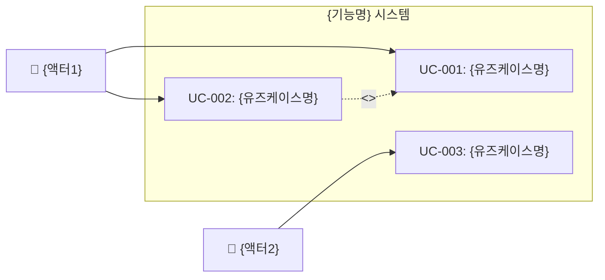
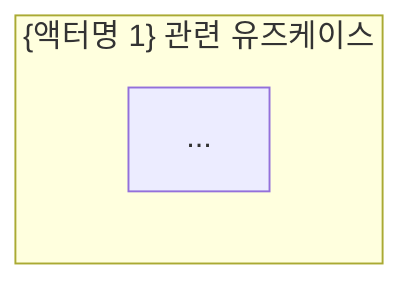

# ASTRA 서비스 기획 산출물 자동 생성

디자인씽킹(Design Thinking) 방법론을 기반으로 기능에 대한 기획 산출물 4종을 자동 생성합니다.

**산출물 목록**:
1. `interview-report.md` — 페르소나 인터뷰 결과서 (페인포인트 포함)
2. `requirements-definition.md` — 요구사항 정의서
3. `usecase-definition.md` — 유즈케이스 정의서 (다이어그램 포함)
4. `feature-definition.md` — 기능 정의서

**산출물 위치**: `docs/planner/{NNN}-{feature-name}/`

## 실행 절차

### Step 0: 사전 준비 및 컨텍스트 수집

#### A. 기능 정보 파싱

`$ARGUMENTS`를 확인한다:

| 인자 형태 | 동작 |
|-----------|------|
| 기능 설명 문자열 (예: `인증 기능`, `결제 시스템`) | 해당 설명을 기반으로 진행 |
| _(없음)_ | `AskUserQuestion`으로 기능 정보를 질문 |

인자가 없으면 다음을 질문한다:

```
## 서비스 기획 산출물 생성

기획하려는 기능 또는 서비스에 대해 설명해 주세요.

예시:
- "소셜 로그인이 포함된 회원 인증 시스템"
- "구독 기반 결제 시스템"
- "팀 협업 워크스페이스 관리"

기능 설명:
```

사용자의 입력을 `{FEATURE_DESCRIPTION}`으로 저장한다.

#### B. 대상 프로젝트 분석

현재 작업 디렉토리에서 다음을 분석한다:

1. `CLAUDE.md` 읽기 — 프로젝트 개요, 기술 스택, 도메인 컨텍스트 확인
2. `docs/planner/` 스캔 — 기존 기획 산출물 번호 확인 (다음 번호 결정)
3. `docs/blueprints/` 스캔 — 기존 블루프린트와의 연계 가능성 확인

#### C. 디렉토리 번호 결정

`docs/planner/` 디렉토리를 스캔하여 기존 디렉토리의 넘버링을 확인하고 다음 번호를 결정한다.

```
NNN = (기존 최대 번호) + 1, 없으면 001
```

기능 설명에서 영문 디렉토리명을 도출한다 (예: `인증 기능` → `auth`, `결제 시스템` → `payment`).

`{OUTPUT_DIR}` = `docs/planner/{NNN}-{feature-name}/`

`AskUserQuestion`으로 디렉토리명을 확인한다:

```
## 산출물 디렉토리 확인

산출물 저장 경로: {OUTPUT_DIR}

이 경로로 진행할까요? 변경이 필요하면 원하는 디렉토리명을 입력하세요.
(예: 001-auth, 002-payment)
```

---

### Step 1: 액터 도출 및 선택

#### A. 액터 자동 도출

`{FEATURE_DESCRIPTION}`을 분석하여 관련된 액터(사용자 유형)를 도출한다.

도출 기준:
- **직접 사용자**: 서비스를 직접 사용하는 주체 (일반 사용자, 구독자, 구매자 등)
- **관리자**: 서비스를 관리/운영하는 주체 (시스템 관리자, 운영자, 콘텐츠 관리자 등)
- **간접 사용자**: 서비스와 간접적으로 상호작용하는 주체 (파트너, API 소비자, 외부 시스템 등)
- **이해관계자**: 서비스의 결과물에 관심을 가지는 주체 (경영진, 마케터 등)

최소 3개, 최대 8개 액터를 도출한다.

#### B. 액터 멀티 선택

도출된 액터 목록을 사용자에게 보여주고 `AskUserQuestion`으로 멀티 선택을 요청한다:

```
## 액터(사용자 유형) 선택

다음은 "{FEATURE_DESCRIPTION}" 관련 도출된 액터 목록입니다.
인터뷰를 진행할 액터를 선택하세요 (콤마로 구분하여 복수 선택 가능).

| # | 액터명 | 유형 | 설명 |
|---|--------|------|------|
| 1 | 일반 사용자 | 직접 사용자 | 서비스를 직접 사용하는 최종 사용자 |
| 2 | 시스템 관리자 | 관리자 | 서비스를 관리하는 운영자 |
| 3 | ... | ... | ... |

선택할 액터 번호 (예: 1,2,3):
```

선택된 액터들을 `{SELECTED_ACTORS}` 배열로 저장한다.

> **참고**: 사용자가 액터를 추가하고 싶다고 하면, 추가 액터를 입력받아 목록에 포함시킨다.

---

### Step 2: 페르소나 인터뷰 실행 및 인터뷰결과서 생성

#### A. 액터별 페르소나 생성

선택된 각 액터에 대해 **3명의 페르소나**를 생성한다.

각 페르소나는 다음 정보를 포함한다:

| 항목 | 설명 |
|------|------|
| 이름 | 한국 이름 (예: 김민수) |
| 나이 | 25~55세 범위 |
| 직업 | 해당 액터의 전형적 직업 |
| 기술 수준 | 초급/중급/고급 |
| 사용 환경 | 모바일/데스크톱/하이브리드 |
| 핵심 목표 | 서비스 사용의 주된 목적 |
| 좌절감 요인 | 기존 경험에서의 불만 |
| 특징 | 사용 패턴, 성향 등 차별화 요소 |

페르소나는 다양한 배경과 관점을 반영해야 한다 (연령대, 기술 숙련도, 사용 목적 등을 분산 배치).

#### B. 페르소나 인터뷰 실행

각 페르소나에 대해 **심층 인터뷰를 시뮬레이션**한다.

인터뷰 질문 카테고리 (각 카테고리 3~5문항, 총 15~20문항):

1. **현재 경험 (As-Is)**
   - 현재 해당 기능과 관련된 과업을 어떻게 수행하는가?
   - 어떤 도구/방법을 사용하는가?
   - 가장 시간이 많이 걸리는 작업은?

2. **페인포인트 (Pain Points)**
   - 가장 불편한 점은?
   - 실수가 자주 발생하는 부분은?
   - 포기하게 되는 시점은?

3. **니즈 & 기대 (Needs & Expectations)**
   - 이상적인 경험은 어떤 것인가?
   - 자동화되었으면 하는 것은?
   - 다른 서비스에서 좋았던 경험은?

4. **가치 & 우선순위 (Value & Priority)**
   - 가장 중요한 기능은?
   - 시간 절약 vs 비용 절감 vs 편의성 중 우선순위는?
   - 비용을 지불할 의향이 있는 기능은?

각 페르소나의 답변은 **페르소나의 특징을 반영한 사실적인 응답**이어야 한다.

#### C. 페인포인트 종합 분석

모든 인터뷰 결과를 분석하여:

1. **액터별 핵심 페인포인트** — 각 액터 유형에서 공통으로 나타나는 페인포인트 5개씩
2. **관심사 키워드** — 각 액터의 핵심 관심사 키워드 5개씩
3. **과업 분석** — 주요 과업의 중요도/시간소모/수행빈도를 5점 척도로 평가
4. **전체 통합 페인포인트** — 전 액터에 걸쳐 가장 심각한 페인포인트 Top 10

#### D. 인터뷰결과서 작성

`{OUTPUT_DIR}/interview-report.md` 파일을 생성한다:

```markdown
# 인터뷰 결과서 — {기능명}

## 1. 개요

| 항목 | 내용 |
|------|------|
| 기능 | {FEATURE_DESCRIPTION} |
| 인터뷰 일자 | {오늘 날짜} |
| 대상 액터 | {선택된 액터 목록} |
| 페르소나 수 | {액터 수 × 3}명 |

## 2. 페르소나 프로필

### 2.1 {액터명 1}

#### 페르소나 1: {이름} ({나이}, {직업})
| 항목 | 내용 |
|------|------|
| 기술 수준 | {초급/중급/고급} |
| 사용 환경 | {모바일/데스크톱/하이브리드} |
| 핵심 목표 | {목표} |
| 좌절감 요인 | {좌절감} |
| 특징 | {특징} |

(페르소나 2, 3도 동일 형식)

### 2.2 {액터명 2}
(동일 형식)

## 3. 인터뷰 상세

### 3.1 {액터명 1}

#### 페르소나 1: {이름}

| # | 질문 | 답변 |
|---|------|------|
| 1 | {질문} | {답변} |
| 2 | {질문} | {답변} |
| ... | ... | ... |

(모든 페르소나에 대해 반복)

## 4. 페인포인트 분석

### 4.1 액터별 핵심 페인포인트

#### {액터명 1}
| # | 페인포인트 | 심각도 (1-5) | 빈도 (1-5) | 영향 범위 |
|---|-----------|------------|-----------|---------|
| 1 | {페인포인트} | {점수} | {점수} | {범위} |
| ... | ... | ... | ... | ... |

### 4.2 액터별 관심사 키워드

| 액터 | 키워드 1 | 키워드 2 | 키워드 3 | 키워드 4 | 키워드 5 |
|------|---------|---------|---------|---------|---------|

### 4.3 과업 분석

| # | 과업 | 중요도 | 시간소모 | 수행빈도 | 핵심 Pain Point |
|---|------|--------|---------|---------|----------------|

### 4.4 전체 통합 페인포인트 Top 10

| 순위 | 페인포인트 | 관련 액터 | 심각도 | 해결 우선순위 |
|------|-----------|---------|--------|------------|
| 1 | {페인포인트} | {액터} | {점수} | {상/중/하} |
| ... | ... | ... | ... | ... |
```

> **중요**: 인터뷰결과서를 작성한 후 사용자에게 "인터뷰결과서가 생성되었습니다. 다음 단계(아이디어 도출)로 진행할까요?"라고 확인한다.

---

### Step 3: 아이디어 도출 및 요구사항 정의서 생성

#### A. 아이디어 도출

인터뷰결과서의 **통합 페인포인트 Top 10**을 기반으로 해결 아이디어를 도출한다.

아이디어 도출 기법:
- **HMW (How Might We)**: 각 페인포인트를 "어떻게 하면 ~할 수 있을까?" 형태로 변환
- **SCAMPER**: 대체(Substitute), 결합(Combine), 적용(Adapt), 수정(Modify), 다른 용도(Put to other use), 제거(Eliminate), 재배치(Reverse)
- **기술 적용**: AI/자동화/UX 개선 등 기술적 해결 방안 포함

최소 10개, 최대 15개 아이디어를 도출한다.

#### B. 아이디어 선택

도출된 아이디어를 사용자에게 보여주고 `AskUserQuestion`으로 멀티 선택을 요청한다:

```
## 해결 아이디어 선택

인터뷰 페인포인트 기반으로 도출된 아이디어입니다.
구현할 아이디어를 선택하세요 (콤마로 구분하여 복수 선택 가능).

| # | HMW 질문 | 아이디어 | 설명 | 해결하는 페인포인트 | 구현 난이도 | 기대 효과 |
|---|---------|---------|------|-----------------|-----------|---------|
| 1 | 어떻게 하면...? | {아이디어} | {설명} | PP-{N} | 상/중/하 | 상/중/하 |
| 2 | ... | ... | ... | ... | ... | ... |

선택할 아이디어 번호 (예: 1,3,5,7):
```

선택된 아이디어들을 `{SELECTED_IDEAS}` 배열로 저장한다.

#### C. 요구사항 정의서 작성

선택된 아이디어를 기반으로 `{OUTPUT_DIR}/requirements-definition.md` 파일을 생성한다:

```markdown
# 요구사항 정의서 — {기능명}

## 1. 개요

| 항목 | 내용 |
|------|------|
| 기능 | {FEATURE_DESCRIPTION} |
| 작성일 | {오늘 날짜} |
| 기반 문서 | interview-report.md |
| 선택된 아이디어 수 | {N}개 |

## 2. 기능 요구사항 (Functional Requirements)

### FR-001: {요구사항 제목}

| 항목 | 내용 |
|------|------|
| ID | FR-001 |
| 요구사항명 | {제목} |
| 설명 | {상세 설명} |
| 관련 아이디어 | IDEA-{N} |
| 관련 페인포인트 | PP-{N} |
| 관련 액터 | {액터 목록} |
| 우선순위 | 필수 / 중요 / 선택 |
| 인수 조건 | {인수 조건 목록} |

(모든 요구사항에 대해 반복)

## 3. 비기능 요구사항 (Non-Functional Requirements)

### NFR-001: {요구사항 제목}

| 항목 | 내용 |
|------|------|
| ID | NFR-001 |
| 유형 | 성능 / 보안 / 사용성 / 접근성 / 호환성 |
| 요구사항명 | {제목} |
| 설명 | {상세 설명} |
| 측정 기준 | {측정 가능한 기준} |
| 우선순위 | 필수 / 중요 / 선택 |

## 4. 요구사항 추적 매트릭스

| 요구사항 ID | 요구사항명 | 페인포인트 | 아이디어 | 액터 | 우선순위 |
|------------|----------|----------|---------|------|---------|
| FR-001 | {제목} | PP-{N} | IDEA-{N} | {액터} | {우선순위} |
| ... | ... | ... | ... | ... | ... |
```

---

### Step 4: 유즈케이스 정의서 생성

인터뷰결과서와 요구사항정의서를 기반으로 각 액터의 유즈케이스를 정의한다.

#### A. 유즈케이스 도출

선택된 각 액터별로 요구사항을 유즈케이스로 매핑한다:

- 하나의 요구사항이 1개 이상의 유즈케이스에 대응
- 유즈케이스 간의 관계: `<<include>>`, `<<extend>>`, 일반화(generalization) 식별

#### B. 유즈케이스 정의서 작성

`{OUTPUT_DIR}/usecase-definition.md` 파일을 생성한다:

```markdown
# 유즈케이스 정의서 — {기능명}

## 1. 개요

| 항목 | 내용 |
|------|------|
| 기능 | {FEATURE_DESCRIPTION} |
| 작성일 | {오늘 날짜} |
| 기반 문서 | interview-report.md, requirements-definition.md |
| 액터 수 | {N}명 |
| 유즈케이스 수 | {N}개 |

## 2. 액터 정의

| # | 액터명 | 유형 | 설명 | 관련 유즈케이스 |
|---|--------|------|------|---------------|
| 1 | {액터명} | {직접/관리자/간접/시스템} | {설명} | UC-001, UC-002, ... |

## 3. 유즈케이스 다이어그램 (Mermaid)

### 3.1 전체 시스템 유즈케이스 다이어그램



### 3.2 {액터명 1} 유즈케이스 다이어그램



(각 액터별 다이어그램)

## 4. 유즈케이스 상세

### UC-001: {유즈케이스명}

| 항목 | 내용 |
|------|------|
| ID | UC-001 |
| 유즈케이스명 | {제목} |
| 주 액터 | {액터명} |
| 보조 액터 | {액터명 또는 없음} |
| 선행 조건 | {선행 조건} |
| 후행 조건 | {성공 시 상태} |
| 관련 요구사항 | FR-001, FR-002 |
| 우선순위 | 상 / 중 / 하 |

**기본 흐름 (Main Flow):**

| 단계 | 액터 | 시스템 |
|------|------|--------|
| 1 | {액터 행동} | |
| 2 | | {시스템 응답} |
| 3 | {액터 행동} | |
| 4 | | {시스템 응답} |

**대안 흐름 (Alternative Flow):**

| 분기점 | 조건 | 흐름 |
|--------|------|------|
| 단계 2 | {조건} | {대안 흐름} |

**예외 흐름 (Exception Flow):**

| 분기점 | 예외 | 처리 |
|--------|------|------|
| 단계 2 | {예외 상황} | {처리 방법} |

(모든 유즈케이스에 대해 반복)

## 5. 유즈케이스 관계 매트릭스

| 유즈케이스 | 관계 유형 | 대상 유즈케이스 | 설명 |
|-----------|---------|-------------|------|
| UC-001 | <<include>> | UC-003 | {설명} |
| UC-002 | <<extend>> | UC-001 | {설명} |

## 6. 요구사항 ↔ 유즈케이스 추적 매트릭스

| 요구사항 ID | 유즈케이스 ID | 커버리지 |
|------------|-------------|---------|
| FR-001 | UC-001, UC-002 | 완전 |
| FR-002 | UC-003 | 부분 |
```

---

### Step 5: 기능 정의서 생성

인터뷰결과서, 요구사항정의서, 유즈케이스정의서를 종합하여 최종 기능 정의서를 생성한다.

#### A. 기능 구조화

요구사항과 유즈케이스를 기반으로 기능을 구조화한다:
- **대기능 (Feature Group)**: 상위 카테고리
- **중기능 (Feature)**: 구현 단위
- **소기능 (Sub-feature)**: 세부 동작

#### B. 기능 정의서 작성

`{OUTPUT_DIR}/feature-definition.md` 파일을 생성한다:

```markdown
# 기능 정의서 — {기능명}

## 1. 개요

| 항목 | 내용 |
|------|------|
| 기능 | {FEATURE_DESCRIPTION} |
| 작성일 | {오늘 날짜} |
| 기반 문서 | interview-report.md, requirements-definition.md, usecase-definition.md |
| 대기능 수 | {N}개 |
| 중기능 수 | {N}개 |
| 소기능 수 | {N}개 |

## 2. 기능 구조

### 2.1 기능 트리

```
{기능명}
├── FG-01: {대기능 1}
│   ├── FT-01-01: {중기능 1}
│   │   ├── SF-01-01-01: {소기능 1}
│   │   └── SF-01-01-02: {소기능 2}
│   └── FT-01-02: {중기능 2}
│       ├── SF-01-02-01: {소기능 1}
│       └── SF-01-02-02: {소기능 2}
├── FG-02: {대기능 2}
│   └── ...
```

## 3. 기능 상세

### FG-01: {대기능명}

#### FT-01-01: {중기능명}

| 항목 | 내용 |
|------|------|
| 기능 ID | FT-01-01 |
| 기능명 | {중기능명} |
| 설명 | {기능 설명} |
| 관련 요구사항 | FR-001, FR-002 |
| 관련 유즈케이스 | UC-001 |
| 관련 액터 | {액터 목록} |
| 우선순위 | 필수 / 중요 / 선택 |
| 구현 난이도 | 상 / 중 / 하 |

**소기능 목록:**

| # | ID | 소기능명 | 설명 | 입력 | 출력 | 비즈니스 규칙 | 우선순위 |
|---|-----|---------|------|------|------|------------|---------|
| 1 | SF-01-01-01 | {소기능명} | {설명} | {입력 데이터} | {출력 데이터} | {규칙} | {우선순위} |
| 2 | SF-01-01-02 | {소기능명} | {설명} | {입력 데이터} | {출력 데이터} | {규칙} | {우선순위} |

(모든 대기능/중기능에 대해 반복)

## 4. 기능 우선순위 매트릭스 (MoSCoW)

| 우선순위 | 기능 ID | 기능명 | 근거 |
|---------|---------|--------|------|
| **Must** | FT-01-01 | {기능명} | {근거} |
| **Should** | FT-01-02 | {기능명} | {근거} |
| **Could** | FT-02-01 | {기능명} | {근거} |
| **Won't** | - | - | - |

## 5. 기능 ↔ 요구사항 ↔ 유즈케이스 통합 추적 매트릭스

| 기능 ID | 기능명 | 요구사항 | 유즈케이스 | 액터 | 페인포인트 | 우선순위 |
|---------|--------|---------|-----------|------|----------|---------|
| FT-01-01 | {기능명} | FR-001 | UC-001 | {액터} | PP-{N} | Must |
| ... | ... | ... | ... | ... | ... | ... |

## 6. 화면 매핑 (참고)

| 기능 ID | 기능명 | 예상 화면 | 비고 |
|---------|--------|---------|------|
| FT-01-01 | {기능명} | {화면명} | {비고} |
```

---

### Step 6: 완료 보고

모든 산출물 생성이 완료되면 사용자에게 결과를 보고한다:

```
## 기획 산출물 생성 완료

📁 산출물 위치: {OUTPUT_DIR}

| # | 산출물 | 파일명 | 상태 |
|---|--------|--------|------|
| 1 | 인터뷰결과서 | interview-report.md | 완료 |
| 2 | 요구사항정의서 | requirements-definition.md | 완료 |
| 3 | 유즈케이스정의서 | usecase-definition.md | 완료 |
| 4 | 기능정의서 | feature-definition.md | 완료 |

### 요약
- 분석 대상 액터: {N}개 유형, {N × 3}명 페르소나
- 도출된 페인포인트: {N}개
- 채택된 아이디어: {N}개
- 정의된 요구사항: 기능 {N}개 + 비기능 {N}개
- 정의된 유즈케이스: {N}개
- 정의된 기능: 대기능 {N}개, 중기능 {N}개, 소기능 {N}개

다음 단계로 `/project-init` 또는 블루프린트 작성을 진행할 수 있습니다.
```
