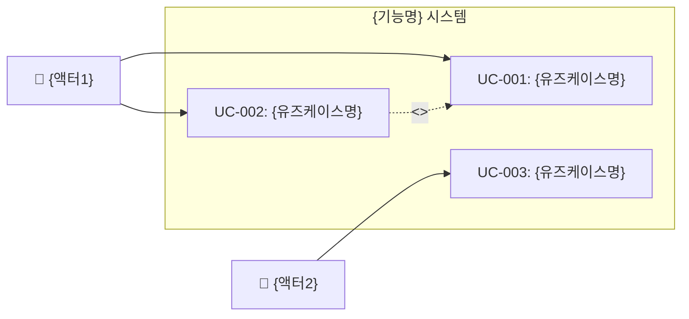
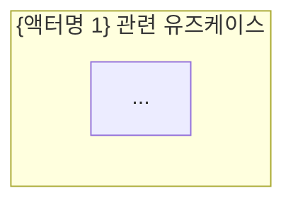
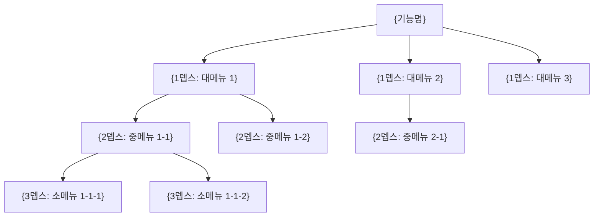
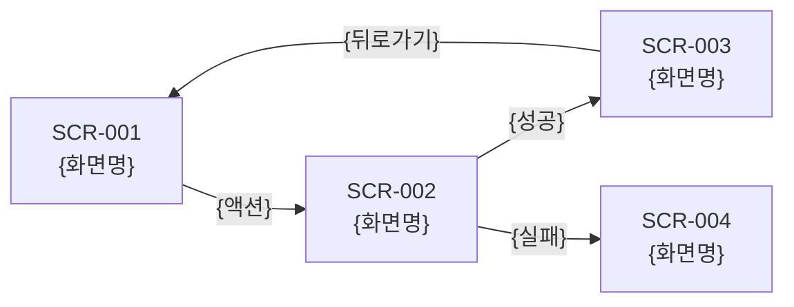

# ASTRA 서비스 기획 산출물 자동 생성

디자인씽킹(Design Thinking) 방법론을 기반으로 기능에 대한 기획 산출물 6종을 자동 생성합니다.

**방법론 매핑**:
- **Empathize**: 시장/경쟁사 분석 + 페르소나 인터뷰
- **Define**: 페인포인트 분석 + JTBD + 요구사항 정의
- **Ideate**: HMW + SCAMPER + 아이디어 도출
- **Prototype**: IA 구조 + 화면 설계 + 기능 정의

**산출물 목록**:
1. `market-analysis.md` — 시장/경쟁사 분석서
2. `interview-report.md` — 페르소나 인터뷰 결과서 (페인포인트 포함)
3. `requirements-definition.md` — 요구사항 정의서 (KPI/OKR + JTBD 포함)
4. `usecase-definition.md` — 유즈케이스 정의서 (다이어그램 + 고객 여정맵 포함)
5. `ia-screen-design.md` — IA 구조 및 화면 설계서 (와이어프레임 포함)
6. `feature-definition.md` — 기능 정의서 (스토리맵 + 리스크 + 정책 포함)

**산출물 위치**: `docs/planner/{NNN}-{feature-name}/`

## 실행 절차

### Step 0: 사전 준비 및 컨텍스트 수집

#### A. 기능 정보 파싱

`$ARGUMENTS`를 확인한다:

| 인자 형태 | 동작 |
|-----------|------|
| 기능 설명 문자열 (예: `인증 기능`, `결제 시스템`) | 해당 설명을 기반으로 진행 |
| _(없음)_ | `AskUserQuestion`으로 기능 정보를 질문 |

인자가 없으면 다음을 질문한다:

```
## 서비스 기획 산출물 생성

기획하려는 기능 또는 서비스에 대해 설명해 주세요.

예시:
- "소셜 로그인이 포함된 회원 인증 시스템"
- "구독 기반 결제 시스템"
- "팀 협업 워크스페이스 관리"

기능 설명:
```

사용자의 입력을 `{FEATURE_DESCRIPTION}`으로 저장한다.

#### B. 기획 모드 선택

`AskUserQuestion`으로 기획 모드를 선택한다:

```
## 기획 모드 선택

어떤 유형의 기획을 진행하시겠습니까?

1. 🆕 신규 서비스 기획 — 새로운 기능/서비스를 처음부터 기획합니다
2. 🔄 기존 서비스 개선 — 운영 중인 서비스의 개선점을 분석하고 개선안을 도출합니다

선택:
```

- **신규 서비스 기획** 선택 시: 기본 워크플로우 그대로 진행
- **기존 서비스 개선** 선택 시: 추가 컨텍스트를 수집한다:

```
## 기존 서비스 개선 — 추가 정보

현재 서비스에 대한 기존 데이터가 있으면 공유해 주세요.
(없으면 "없음"이라고 입력하세요)

제공 가능한 정보:
- 사용자 피드백/리뷰 데이터 (파일 경로 또는 텍스트)
- 사용량 분석 지표 (DAU, 이탈률, 전환율 등)
- CS 인입 유형 Top 10
- 기존 서비스 URL 또는 화면 캡처 경로
- 이전 개선 이력

입력:
```

수집된 정보를 `{EXISTING_SERVICE_DATA}`로 저장하고, 이후 단계에서 페르소나 인터뷰와 시장 분석에 반영한다.

#### C. 대상 프로젝트 분석

현재 작업 디렉토리에서 다음을 분석한다:

1. `CLAUDE.md` 읽기 — 프로젝트 개요, 기술 스택, 도메인 컨텍스트 확인
2. `docs/planner/` 스캔 — 기존 기획 산출물 번호 확인 (다음 번호 결정)
3. `docs/blueprints/` 스캔 — 기존 블루프린트와의 연계 가능성 확인

#### D. 디렉토리 번호 결정

`docs/planner/` 디렉토리를 스캔하여 기존 디렉토리의 넘버링을 확인하고 다음 번호를 결정한다.

```
NNN = (기존 최대 번호) + 1, 없으면 001
```

기능 설명에서 영문 디렉토리명을 도출한다 (예: `인증 기능` → `auth`, `결제 시스템` → `payment`).

`{OUTPUT_DIR}` = `docs/planner/{NNN}-{feature-name}/`

`AskUserQuestion`으로 디렉토리명을 확인한다:

```
## 산출물 디렉토리 확인

산출물 저장 경로: {OUTPUT_DIR}

이 경로로 진행할까요? 변경이 필요하면 원하는 디렉토리명을 입력하세요.
(예: 001-auth, 002-payment)
```

---

### Step 1: 시장/경쟁사 분석서 생성

#### A. 시장 환경 분석

`{FEATURE_DESCRIPTION}`과 프로젝트 컨텍스트를 기반으로 다음을 분석한다:

1. **PEST 분석**: 정치(Political), 경제(Economic), 사회(Social), 기술(Technological) 요인
2. **시장 규모 및 트렌드**: 해당 도메인의 시장 동향, 성장세, 주요 변화
3. **타겟 시장**: 목표 고객군, 시장 세그먼트

> **기존 서비스 개선 모드**: `{EXISTING_SERVICE_DATA}`가 있으면 현재 서비스의 포지셔닝과 시장 내 위치를 함께 분석한다.

#### B. 경쟁사 벤치마킹

유사 서비스/제품을 3~5개 선정하여 벤치마킹한다:

- 직접 경쟁사 (동일 기능을 제공하는 서비스)
- 간접 경쟁사 (유사한 문제를 다른 방식으로 해결하는 서비스)
- 글로벌 레퍼런스 (해외 우수 사례)

#### C. SWOT 분석

프로젝트의 강점(Strengths), 약점(Weaknesses), 기회(Opportunities), 위협(Threats)을 도출한다.

#### D. 시장분석서 작성

`{OUTPUT_DIR}/market-analysis.md` 파일을 생성한다:

```markdown
# 시장/경쟁사 분석서 — {기능명}

## 1. 개요

| 항목 | 내용 |
|------|------|
| 기능 | {FEATURE_DESCRIPTION} |
| 분석일 | {오늘 날짜} |
| 기획 모드 | {신규 서비스 기획 / 기존 서비스 개선} |

## 2. 시장 환경 분석 (PEST)

| 요인 | 분석 내용 | 시사점 |
|------|----------|--------|
| 정치/법률 (P) | {관련 규제, 정책, 법률 동향} | {기획에 미치는 영향} |
| 경제 (E) | {시장 규모, 성장률, 경제 트렌드} | {기획에 미치는 영향} |
| 사회/문화 (S) | {사용자 행동 변화, 인구통계 트렌드} | {기획에 미치는 영향} |
| 기술 (T) | {기술 발전, 플랫폼 변화, AI/자동화 트렌드} | {기획에 미치는 영향} |

## 3. 경쟁사 벤치마킹

### 3.1 경쟁 구도

| # | 서비스명 | 유형 | 핵심 특징 | 타겟 고객 | 과금 모델 |
|---|---------|------|---------|---------|---------|
| 1 | {서비스명} | 직접 경쟁 | {특징} | {타겟} | {모델} |
| 2 | {서비스명} | 간접 경쟁 | {특징} | {타겟} | {모델} |
| 3 | {서비스명} | 글로벌 레퍼런스 | {특징} | {타겟} | {모델} |

### 3.2 기능 비교 매트릭스

| 기능 | 우리 서비스 | 경쟁사 A | 경쟁사 B | 경쟁사 C |
|------|-----------|---------|---------|---------|
| {핵심 기능 1} | {O/X/△} | {O/X/△} | {O/X/△} | {O/X/△} |
| {핵심 기능 2} | {O/X/△} | {O/X/△} | {O/X/△} | {O/X/△} |
| {핵심 기능 3} | {O/X/△} | {O/X/△} | {O/X/△} | {O/X/△} |

### 3.3 차별화 포인트

| # | 차별화 요소 | 설명 | 경쟁 우위 수준 |
|---|-----------|------|-------------|
| 1 | {요소} | {설명} | 강/중/약 |

## 4. SWOT 분석

| | 긍정적 | 부정적 |
|---|--------|--------|
| **내부** | **강점 (S)** | **약점 (W)** |
| | - {강점 1} | - {약점 1} |
| | - {강점 2} | - {약점 2} |
| **외부** | **기회 (O)** | **위협 (T)** |
| | - {기회 1} | - {위협 1} |
| | - {기회 2} | - {위협 2} |

### 4.1 SO/ST/WO/WT 전략 도출

| 전략 | 설명 |
|------|------|
| SO 전략 (강점×기회) | {강점을 활용하여 기회를 포착하는 전략} |
| ST 전략 (강점×위협) | {강점을 활용하여 위협에 대응하는 전략} |
| WO 전략 (약점×기회) | {약점을 보완하여 기회를 활용하는 전략} |
| WT 전략 (약점×위협) | {약점과 위협을 최소화하는 전략} |

## 5. 시장 시사점 및 기획 방향

| # | 시사점 | 기획 반영 방향 | 우선순위 |
|---|--------|-------------|---------|
| 1 | {시사점} | {반영 방향} | 상/중/하 |
| 2 | {시사점} | {반영 방향} | 상/중/하 |
```

> **중요**: 시장분석서를 작성한 후 사용자에게 "시장분석서가 생성되었습니다. 다음 단계(액터 도출)로 진행할까요?"라고 확인한다.

---

### Step 2: 액터 도출 및 선택

#### A. 액터 자동 도출

`{FEATURE_DESCRIPTION}`과 시장분석 결과를 종합하여 관련된 액터(사용자 유형)를 도출한다.

도출 기준:
- **직접 사용자**: 서비스를 직접 사용하는 주체 (일반 사용자, 구독자, 구매자 등)
- **관리자**: 서비스를 관리/운영하는 주체 (시스템 관리자, 운영자, 콘텐츠 관리자 등)
- **간접 사용자**: 서비스와 간접적으로 상호작용하는 주체 (파트너, API 소비자, 외부 시스템 등)
- **이해관계자**: 서비스의 결과물에 관심을 가지는 주체 (경영진, 마케터 등)

최소 3개, 최대 8개 액터를 도출한다.

#### B. 액터 멀티 선택

도출된 액터 목록을 사용자에게 보여주고 `AskUserQuestion`으로 멀티 선택을 요청한다:

```
## 액터(사용자 유형) 선택

다음은 "{FEATURE_DESCRIPTION}" 관련 도출된 액터 목록입니다.
인터뷰를 진행할 액터를 선택하세요 (콤마로 구분하여 복수 선택 가능).

| # | 액터명 | 유형 | 설명 |
|---|--------|------|------|
| 1 | 일반 사용자 | 직접 사용자 | 서비스를 직접 사용하는 최종 사용자 |
| 2 | 시스템 관리자 | 관리자 | 서비스를 관리하는 운영자 |
| 3 | ... | ... | ... |

선택할 액터 번호 (예: 1,2,3):
```

선택된 액터들을 `{SELECTED_ACTORS}` 배열로 저장한다.

> **참고**: 사용자가 액터를 추가하고 싶다고 하면, 추가 액터를 입력받아 목록에 포함시킨다.

---

### Step 3: 페르소나 인터뷰 실행 및 인터뷰결과서 생성

#### A. 액터별 페르소나 생성

선택된 각 액터에 대해 **3명의 페르소나**를 생성한다.

각 페르소나는 다음 정보를 포함한다:

| 항목 | 설명 |
|------|------|
| 이름 | 한국 이름 (예: 김민수) |
| 나이 | 25~55세 범위 |
| 직업 | 해당 액터의 전형적 직업 |
| 기술 수준 | 초급/중급/고급 |
| 사용 환경 | 모바일/데스크톱/하이브리드 |
| 핵심 목표 | 서비스 사용의 주된 목적 |
| 좌절감 요인 | 기존 경험에서의 불만 |
| 특징 | 사용 패턴, 성향 등 차별화 요소 |

페르소나는 다양한 배경과 관점을 반영해야 한다 (연령대, 기술 숙련도, 사용 목적 등을 분산 배치).

> **기존 서비스 개선 모드**: `{EXISTING_SERVICE_DATA}`의 실제 사용자 피드백/CS 데이터를 페르소나의 좌절감 요인과 인터뷰 답변에 반영한다.

#### B. 페르소나 인터뷰 실행

각 페르소나에 대해 **심층 인터뷰를 시뮬레이션**한다.

인터뷰 질문 카테고리 (각 카테고리 3~5문항, 총 15~20문항):

1. **현재 경험 (As-Is)**
   - 현재 해당 기능과 관련된 과업을 어떻게 수행하는가?
   - 어떤 도구/방법을 사용하는가?
   - 가장 시간이 많이 걸리는 작업은?

2. **페인포인트 (Pain Points)**
   - 가장 불편한 점은?
   - 실수가 자주 발생하는 부분은?
   - 포기하게 되는 시점은?

3. **니즈 & 기대 (Needs & Expectations)**
   - 이상적인 경험은 어떤 것인가?
   - 자동화되었으면 하는 것은?
   - 다른 서비스에서 좋았던 경험은?

4. **가치 & 우선순위 (Value & Priority)**
   - 가장 중요한 기능은?
   - 시간 절약 vs 비용 절감 vs 편의성 중 우선순위는?
   - 비용을 지불할 의향이 있는 기능은?

각 페르소나의 답변은 **페르소나의 특징을 반영한 사실적인 응답**이어야 한다.

#### C. 페인포인트 종합 분석

모든 인터뷰 결과를 분석하여:

1. **액터별 핵심 페인포인트** — 각 액터 유형에서 공통으로 나타나는 페인포인트 5개씩
2. **관심사 키워드** — 각 액터의 핵심 관심사 키워드 5개씩
3. **과업 분석** — 주요 과업의 중요도/시간소모/수행빈도를 5점 척도로 평가
4. **전체 통합 페인포인트** — 전 액터에 걸쳐 가장 심각한 페인포인트 Top 10

#### D. 인터뷰결과서 작성

`{OUTPUT_DIR}/interview-report.md` 파일을 생성한다:

```markdown
# 인터뷰 결과서 — {기능명}

## 1. 개요

| 항목 | 내용 |
|------|------|
| 기능 | {FEATURE_DESCRIPTION} |
| 인터뷰 일자 | {오늘 날짜} |
| 대상 액터 | {선택된 액터 목록} |
| 페르소나 수 | {액터 수 × 3}명 |

## 2. 페르소나 프로필

### 2.1 {액터명 1}

#### 페르소나 1: {이름} ({나이}, {직업})
| 항목 | 내용 |
|------|------|
| 기술 수준 | {초급/중급/고급} |
| 사용 환경 | {모바일/데스크톱/하이브리드} |
| 핵심 목표 | {목표} |
| 좌절감 요인 | {좌절감} |
| 특징 | {특징} |

(페르소나 2, 3도 동일 형식)

### 2.2 {액터명 2}
(동일 형식)

## 3. 인터뷰 상세

### 3.1 {액터명 1}

#### 페르소나 1: {이름}

| # | 질문 | 답변 |
|---|------|------|
| 1 | {질문} | {답변} |
| 2 | {질문} | {답변} |
| ... | ... | ... |

(모든 페르소나에 대해 반복)

## 4. 페인포인트 분석

### 4.1 액터별 핵심 페인포인트

#### {액터명 1}
| # | 페인포인트 | 심각도 (1-5) | 빈도 (1-5) | 영향 범위 |
|---|-----------|------------|-----------|---------|
| 1 | {페인포인트} | {점수} | {점수} | {범위} |
| ... | ... | ... | ... | ... |

### 4.2 액터별 관심사 키워드

| 액터 | 키워드 1 | 키워드 2 | 키워드 3 | 키워드 4 | 키워드 5 |
|------|---------|---------|---------|---------|---------|

### 4.3 과업 분석

| # | 과업 | 중요도 | 시간소모 | 수행빈도 | 핵심 Pain Point |
|---|------|--------|---------|---------|----------------|

### 4.4 전체 통합 페인포인트 Top 10

| 순위 | 페인포인트 | 관련 액터 | 심각도 | 해결 우선순위 |
|------|-----------|---------|--------|------------|
| 1 | {페인포인트} | {액터} | {점수} | {상/중/하} |
| ... | ... | ... | ... | ... |
```

> **중요**: 인터뷰결과서를 작성한 후 사용자에게 "인터뷰결과서가 생성되었습니다. 다음 단계(아이디어 도출)로 진행할까요?"라고 확인한다.

---

### Step 4: 아이디어 도출 및 요구사항 정의서 생성

#### A. 아이디어 도출

인터뷰결과서의 **통합 페인포인트 Top 10**과 시장분석서의 **기획 방향**을 기반으로 해결 아이디어를 도출한다.

아이디어 도출 기법:
- **HMW (How Might We)**: 각 페인포인트를 "어떻게 하면 ~할 수 있을까?" 형태로 변환
- **SCAMPER**: 대체(Substitute), 결합(Combine), 적용(Adapt), 수정(Modify), 다른 용도(Put to other use), 제거(Eliminate), 재배치(Reverse)
- **JTBD (Jobs-to-be-Done)**: 각 핵심 페인포인트에 대해 Job Statement를 작성한다:
  - 형식: "**When** [상황/맥락], **I want to** [동기/행동], **so I can** [기대 결과]"
  - 각 JTBD에서 현재 underserved된 니즈를 식별하여 아이디어에 반영
- **기술 적용**: AI/자동화/UX 개선 등 기술적 해결 방안 포함

최소 10개, 최대 15개 아이디어를 도출한다.

#### B. 아이디어 선택

도출된 아이디어를 사용자에게 보여주고 `AskUserQuestion`으로 멀티 선택을 요청한다:

```
## 해결 아이디어 선택

인터뷰 페인포인트 + 시장분석 기반으로 도출된 아이디어입니다.
구현할 아이디어를 선택하세요 (콤마로 구분하여 복수 선택 가능).

| # | JTBD | HMW 질문 | 아이디어 | 설명 | 해결하는 페인포인트 | 구현 난이도 | 기대 효과 |
|---|------|---------|---------|------|-----------------|-----------|---------|
| 1 | When..., I want to..., so I can... | 어떻게 하면...? | {아이디어} | {설명} | PP-{N} | 상/중/하 | 상/중/하 |
| 2 | ... | ... | ... | ... | ... | ... | ... |

선택할 아이디어 번호 (예: 1,3,5,7):
```

선택된 아이디어들을 `{SELECTED_IDEAS}` 배열로 저장한다.

#### C. 요구사항 정의서 작성

선택된 아이디어를 기반으로 `{OUTPUT_DIR}/requirements-definition.md` 파일을 생성한다:

```markdown
# 요구사항 정의서 — {기능명}

## 1. 개요

| 항목 | 내용 |
|------|------|
| 기능 | {FEATURE_DESCRIPTION} |
| 작성일 | {오늘 날짜} |
| 기반 문서 | market-analysis.md, interview-report.md |
| 선택된 아이디어 수 | {N}개 |

## 2. 성공 지표 (KPI / OKR)

### 2.1 비즈니스 목표 (Objectives)

| # | 목표 (Objective) | 설명 | 관련 전략 |
|---|-----------------|------|---------|
| O1 | {목표} | {설명} | {SWOT 전략 참조} |
| O2 | {목표} | {설명} | {SWOT 전략 참조} |

### 2.2 핵심 결과 (Key Results)

| # | 소속 목표 | 핵심 결과 (Key Result) | 현재값 | 목표값 | 측정 방법 |
|---|---------|---------------------|--------|--------|---------|
| KR1 | O1 | {측정 가능한 결과} | {baseline 또는 N/A} | {목표} | {측정 방법} |
| KR2 | O1 | {측정 가능한 결과} | {baseline 또는 N/A} | {목표} | {측정 방법} |
| KR3 | O2 | {측정 가능한 결과} | {baseline 또는 N/A} | {목표} | {측정 방법} |

### 2.3 KPI 대시보드 항목

| # | KPI명 | 설명 | 측정 주기 | 목표 기준 | 관련 KR |
|---|-------|------|---------|---------|--------|
| 1 | {KPI} | {설명} | 일/주/월 | {기준} | KR{N} |

## 3. JTBD (Jobs-to-be-Done) 정리

| # | Job Statement | 관련 페인포인트 | 현재 해결 수준 | 기대 해결 수준 | 관련 아이디어 |
|---|--------------|-------------|-------------|-------------|------------|
| J1 | When {상황}, I want to {동기}, so I can {결과} | PP-{N} | {1-5} | {1-5} | IDEA-{N} |
| J2 | When {상황}, I want to {동기}, so I can {결과} | PP-{N} | {1-5} | {1-5} | IDEA-{N} |

## 4. 기능 요구사항 (Functional Requirements)

### FR-001: {요구사항 제목}

| 항목 | 내용 |
|------|------|
| ID | FR-001 |
| 요구사항명 | {제목} |
| 설명 | {상세 설명} |
| 관련 아이디어 | IDEA-{N} |
| 관련 페인포인트 | PP-{N} |
| 관련 JTBD | J{N} |
| 관련 액터 | {액터 목록} |
| 우선순위 | 필수 / 중요 / 선택 |
| 인수 조건 | {인수 조건 목록} |
| 관련 KPI | {KPI명} |

(모든 요구사항에 대해 반복)

## 5. 비기능 요구사항 (Non-Functional Requirements)

### NFR-001: {요구사항 제목}

| 항목 | 내용 |
|------|------|
| ID | NFR-001 |
| 유형 | 성능 / 보안 / 사용성 / 접근성 / 호환성 |
| 요구사항명 | {제목} |
| 설명 | {상세 설명} |
| 측정 기준 | {측정 가능한 기준} |
| 우선순위 | 필수 / 중요 / 선택 |

## 6. 요구사항 추적 매트릭스

| 요구사항 ID | 요구사항명 | 페인포인트 | JTBD | 아이디어 | 액터 | KPI | 우선순위 |
|------------|----------|----------|------|---------|------|-----|---------|
| FR-001 | {제목} | PP-{N} | J{N} | IDEA-{N} | {액터} | {KPI} | {우선순위} |
| ... | ... | ... | ... | ... | ... | ... | ... |
```

---

### Step 5: 유즈케이스 정의서 생성

인터뷰결과서와 요구사항정의서를 기반으로 각 액터의 유즈케이스를 정의한다.

#### A. 유즈케이스 도출

선택된 각 액터별로 요구사항을 유즈케이스로 매핑한다:

- 하나의 요구사항이 1개 이상의 유즈케이스에 대응
- 유즈케이스 간의 관계: `<<include>>`, `<<extend>>`, 일반화(generalization) 식별

#### B. 고객 여정맵 (Customer Journey Map) 도출

핵심 유즈케이스(3~5개)에 대해 고객 여정맵을 작성한다:

여정맵 구성요소:
- **단계 (Phase)**: 서비스 접점의 시간 순서 (인지 → 탐색 → 가입 → 사용 → 재방문)
- **행동 (Action)**: 각 단계에서 사용자가 하는 행동
- **접점 (Touchpoint)**: 서비스와 만나는 채널/화면
- **감정 (Emotion)**: 각 단계의 사용자 감정 상태 (😊 긍정 / 😐 중립 / 😤 부정)
- **페인포인트**: 각 단계에서 발생하는 불편
- **기회 영역 (Opportunity)**: 개선 가능한 포인트

#### C. 유즈케이스 정의서 작성

`{OUTPUT_DIR}/usecase-definition.md` 파일을 생성한다:

```markdown
# 유즈케이스 정의서 — {기능명}

## 1. 개요

| 항목 | 내용 |
|------|------|
| 기능 | {FEATURE_DESCRIPTION} |
| 작성일 | {오늘 날짜} |
| 기반 문서 | market-analysis.md, interview-report.md, requirements-definition.md |
| 액터 수 | {N}명 |
| 유즈케이스 수 | {N}개 |

## 2. 액터 정의

| # | 액터명 | 유형 | 설명 | 관련 유즈케이스 |
|---|--------|------|------|---------------|
| 1 | {액터명} | {직접/관리자/간접/시스템} | {설명} | UC-001, UC-002, ... |

## 3. 고객 여정맵 (Customer Journey Map)

### 3.1 {핵심 유즈케이스/시나리오명} — {주요 액터}

```mermaid
journey
    title {시나리오명}
    section {단계 1: 인지/탐색}
      {행동 1}: {감정점수 1-5}: {액터}
      {행동 2}: {감정점수 1-5}: {액터}
    section {단계 2: 가입/설정}
      {행동 3}: {감정점수 1-5}: {액터}
      {행동 4}: {감정점수 1-5}: {액터}
    section {단계 3: 핵심 사용}
      {행동 5}: {감정점수 1-5}: {액터}
    section {단계 4: 결과/재방문}
      {행동 6}: {감정점수 1-5}: {액터}
```

**여정 상세**:

| 단계 | 행동 | 접점 | 감정 | 페인포인트 | 기회 영역 |
|------|------|------|------|----------|---------|
| {단계 1} | {행동} | {화면/채널} | {😊/😐/😤} | {불편사항} | {개선 포인트} |
| {단계 2} | {행동} | {화면/채널} | {😊/😐/😤} | {불편사항} | {개선 포인트} |

(핵심 유즈케이스 3~5개에 대해 반복)

## 4. 유즈케이스 다이어그램 (Mermaid)

### 4.1 전체 시스템 유즈케이스 다이어그램



### 4.2 {액터명 1} 유즈케이스 다이어그램



(각 액터별 다이어그램)

## 5. 유즈케이스 상세

### UC-001: {유즈케이스명}

| 항목 | 내용 |
|------|------|
| ID | UC-001 |
| 유즈케이스명 | {제목} |
| 주 액터 | {액터명} |
| 보조 액터 | {액터명 또는 없음} |
| 선행 조건 | {선행 조건} |
| 후행 조건 | {성공 시 상태} |
| 관련 요구사항 | FR-001, FR-002 |
| 관련 JTBD | J{N} |
| 우선순위 | 상 / 중 / 하 |

**기본 흐름 (Main Flow):**

| 단계 | 액터 | 시스템 |
|------|------|--------|
| 1 | {액터 행동} | |
| 2 | | {시스템 응답} |
| 3 | {액터 행동} | |
| 4 | | {시스템 응답} |

**대안 흐름 (Alternative Flow):**

| 분기점 | 조건 | 흐름 |
|--------|------|------|
| 단계 2 | {조건} | {대안 흐름} |

**예외 흐름 (Exception Flow):**

| 분기점 | 예외 | 처리 |
|--------|------|------|
| 단계 2 | {예외 상황} | {처리 방법} |

(모든 유즈케이스에 대해 반복)

## 6. 유즈케이스 관계 매트릭스

| 유즈케이스 | 관계 유형 | 대상 유즈케이스 | 설명 |
|-----------|---------|-------------|------|
| UC-001 | <<include>> | UC-003 | {설명} |
| UC-002 | <<extend>> | UC-001 | {설명} |

## 7. 요구사항 ↔ 유즈케이스 추적 매트릭스

| 요구사항 ID | 유즈케이스 ID | 커버리지 |
|------------|-------------|---------|
| FR-001 | UC-001, UC-002 | 완전 |
| FR-002 | UC-003 | 부분 |
```

---

### Step 6: IA 구조 및 화면 설계서 생성

유즈케이스 정의서와 요구사항 정의서를 기반으로 정보구조(IA)를 설계하고 주요 화면의 와이어프레임을 작성한다.

#### A. IA (Information Architecture) 설계

기능 정의와 유즈케이스를 기반으로 서비스의 전체 메뉴 구조를 설계한다:

- **1뎁스**: 대메뉴 (GNB)
- **2뎁스**: 중메뉴 (LNB 또는 탭)
- **3뎁스**: 소메뉴 (세부 페이지)

각 메뉴 항목에 관련 유즈케이스와 요구사항을 매핑한다.

#### B. 화면 흐름도 (Screen Flow)

주요 사용자 시나리오(유즈케이스 기본 흐름 기준)의 화면 이동 경로를 Mermaid 플로우차트로 작성한다.

#### C. 텍스트 기반 와이어프레임

핵심 화면(3~5개)에 대해 ASCII 기반 와이어프레임을 작성한다:

- 레이아웃 구조 (헤더, 사이드바, 콘텐츠, 푸터)
- 주요 UI 요소 배치 (버튼, 입력 필드, 테이블, 카드 등)
- 각 요소의 기능 설명

#### D. IA 구조 및 화면 설계서 작성

`{OUTPUT_DIR}/ia-screen-design.md` 파일을 생성한다:

```markdown
# IA 구조 및 화면 설계서 — {기능명}

## 1. 개요

| 항목 | 내용 |
|------|------|
| 기능 | {FEATURE_DESCRIPTION} |
| 작성일 | {오늘 날짜} |
| 기반 문서 | requirements-definition.md, usecase-definition.md |
| 총 화면 수 | {N}개 |

## 2. IA (정보구조도)

### 2.1 메뉴 트리



### 2.2 IA 상세

| 뎁스 | 메뉴ID | 메뉴명 | 화면ID | 설명 | 관련 UC | 관련 FR | 접근 권한 |
|------|--------|--------|--------|------|--------|--------|---------|
| 1 | M1 | {대메뉴 1} | — | {설명} | — | — | {권한} |
| 2 | M1-1 | {중메뉴 1-1} | SCR-001 | {설명} | UC-001 | FR-001 | {권한} |
| 3 | M1-1-1 | {소메뉴 1-1-1} | SCR-002 | {설명} | UC-001 | FR-001 | {권한} |

## 3. 화면 흐름도 (Screen Flow)

### 3.1 {시나리오명} 흐름



(주요 시나리오 2~3개에 대해 반복)

## 4. 화면 목록

| 화면ID | 화면명 | 유형 | 관련 UC | 관련 FR | 설명 |
|--------|--------|------|--------|--------|------|
| SCR-001 | {화면명} | 목록/상세/폼/모달/대시보드 | UC-001 | FR-001 | {설명} |
| SCR-002 | {화면명} | {유형} | UC-002 | FR-002 | {설명} |

## 5. 와이어프레임

### SCR-001: {화면명}

**화면 설명**: {화면의 목적과 주요 기능}
**관련 UC**: UC-001 | **관련 FR**: FR-001, FR-002

```
┌─────────────────────────────────────────────┐
│  [Logo]          {서비스명}        [👤 프로필] │
├─────────────────────────────────────────────┤
│ ┌─────┐  ┌─────────────────────────────────┐│
│ │     │  │  📋 {섹션 제목}                  ││
│ │ 메뉴 │  │                                 ││
│ │     │  │  ┌──────────────────────────┐    ││
│ │ • A  │  │  │ {데이터 영역}            │    ││
│ │ • B  │  │  │                          │    ││
│ │ • C  │  │  │  [항목 1]  [항목 2]       │    ││
│ │     │  │  │  [항목 3]  [항목 4]       │    ││
│ │     │  │  └──────────────────────────┘    ││
│ │     │  │                                 ││
│ │     │  │  [+ 추가]          [저장] [취소] ││
│ └─────┘  └─────────────────────────────────┘│
├─────────────────────────────────────────────┤
│  © {서비스명}  |  이용약관  |  개인정보처리방침  │
└─────────────────────────────────────────────┘
```

**UI 요소 설명**:

| # | 요소 | 유형 | 설명 | 동작 |
|---|------|------|------|------|
| 1 | {요소명} | 버튼/입력/테이블/... | {설명} | {클릭/입력 시 동작} |
| 2 | {요소명} | {유형} | {설명} | {동작} |

(핵심 화면 3~5개에 대해 반복)

## 6. 화면 ↔ 유즈케이스 ↔ 요구사항 추적

| 화면ID | 화면명 | 유즈케이스 | 요구사항 | 액터 |
|--------|--------|-----------|---------|------|
| SCR-001 | {화면명} | UC-001 | FR-001, FR-002 | {액터} |
```

---

### Step 7: 기능 정의서 생성

인터뷰결과서, 요구사항정의서, 유즈케이스정의서, IA/화면설계서를 종합하여 최종 기능 정의서를 생성한다.

#### A. 기능 구조화

요구사항과 유즈케이스를 기반으로 기능을 구조화한다:
- **대기능 (Feature Group)**: 상위 카테고리
- **중기능 (Feature)**: 구현 단위
- **소기능 (Sub-feature)**: 세부 동작

#### B. User Story Mapping

기능을 User Story Map 형태로 재배치하여 MVP 범위를 시각화한다:
- **User Activity** (행): 사용자의 큰 활동 단위 (대기능에 대응)
- **User Task** (행): 활동 내 구체적 과업 (중기능에 대응)
- **User Story** (열): 과업의 세부 스토리 (소기능에 대응)
- **Release Slice**: MVP / v1.1 / v1.2 등 릴리스 단위로 수평 구분

#### C. 기능 정의서 작성

`{OUTPUT_DIR}/feature-definition.md` 파일을 생성한다:

```markdown
# 기능 정의서 — {기능명}

## 1. 개요

| 항목 | 내용 |
|------|------|
| 기능 | {FEATURE_DESCRIPTION} |
| 작성일 | {오늘 날짜} |
| 기반 문서 | market-analysis.md, interview-report.md, requirements-definition.md, usecase-definition.md, ia-screen-design.md |
| 대기능 수 | {N}개 |
| 중기능 수 | {N}개 |
| 소기능 수 | {N}개 |

## 2. 기능 구조

### 2.1 기능 트리

```
{기능명}
├── FG-01: {대기능 1}
│   ├── FT-01-01: {중기능 1}
│   │   ├── SF-01-01-01: {소기능 1}
│   │   └── SF-01-01-02: {소기능 2}
│   └── FT-01-02: {중기능 2}
│       ├── SF-01-02-01: {소기능 1}
│       └── SF-01-02-02: {소기능 2}
├── FG-02: {대기능 2}
│   └── ...
```

## 3. User Story Map

### 3.1 스토리 맵 뷰

```
┌─────────────────────────────────────────────────────────────────────┐
│ User          │ {Activity 1}       │ {Activity 2}       │ ...      │
│ Activities    │ (FG-01)            │ (FG-02)            │          │
├───────────────┼────────────────────┼────────────────────┼──────────┤
│ User          │ {Task 1-1}         │ {Task 2-1}         │          │
│ Tasks         │ {Task 1-2}         │ {Task 2-2}         │          │
├═══════════════╪════════════════════╪════════════════════╪══════════┤
│ MVP           │ • {Story 1-1-1}    │ • {Story 2-1-1}    │          │
│ (Release 1)   │ • {Story 1-2-1}    │                    │          │
├───────────────┼────────────────────┼────────────────────┼──────────┤
│ v1.1          │ • {Story 1-1-2}    │ • {Story 2-1-2}    │          │
│ (Release 2)   │                    │ • {Story 2-2-1}    │          │
├───────────────┼────────────────────┼────────────────────┼──────────┤
│ v1.2          │ • {Story 1-2-2}    │ • {Story 2-2-2}    │          │
│ (Release 3)   │                    │                    │          │
└───────────────┴────────────────────┴────────────────────┴──────────┘
```

### 3.2 릴리스 범위 정의

| 릴리스 | 포함 기능 | 목표 | 예상 소기능 수 |
|--------|---------|------|-------------|
| MVP (Release 1) | {핵심 기능 목록} | {최소 가치 제공} | {N}개 |
| v1.1 (Release 2) | {추가 기능 목록} | {사용성 향상} | {N}개 |
| v1.2 (Release 3) | {확장 기능 목록} | {고도화} | {N}개 |

## 4. 기능 상세

### FG-01: {대기능명}

#### FT-01-01: {중기능명}

| 항목 | 내용 |
|------|------|
| 기능 ID | FT-01-01 |
| 기능명 | {중기능명} |
| 설명 | {기능 설명} |
| 관련 요구사항 | FR-001, FR-002 |
| 관련 유즈케이스 | UC-001 |
| 관련 화면 | SCR-001, SCR-002 |
| 관련 액터 | {액터 목록} |
| 관련 KPI | {KPI명} |
| 우선순위 | 필수 / 중요 / 선택 |
| 구현 난이도 | 상 / 중 / 하 |
| 릴리스 | MVP / v1.1 / v1.2 |

**소기능 목록:**

| # | ID | 소기능명 | 설명 | 입력 | 출력 | 비즈니스 규칙/정책 | 우선순위 |
|---|-----|---------|------|------|------|----------------|---------|
| 1 | SF-01-01-01 | {소기능명} | {설명} | {입력 데이터} | {출력 데이터} | {비즈니스 규칙 및 서비스 정책} | {우선순위} |
| 2 | SF-01-01-02 | {소기능명} | {설명} | {입력 데이터} | {출력 데이터} | {비즈니스 규칙 및 서비스 정책} | {우선순위} |

(모든 대기능/중기능에 대해 반복)

## 5. 서비스 정책

### 5.1 서비스 운영 정책

| # | 정책 항목 | 정책 내용 | 관련 기능 | 비고 |
|---|---------|---------|---------|------|
| 1 | {정책 항목} | {구체적 정책 내용} | FT-{N} | {비고} |
| 2 | {정책 항목} | {구체적 정책 내용} | FT-{N} | {비고} |

### 5.2 데이터 처리 정책

| # | 데이터 항목 | 보존 기간 | 처리 방식 | 관련 기능 |
|---|-----------|---------|---------|---------|
| 1 | {데이터} | {기간} | {암호화/마스킹/삭제 등} | FT-{N} |

### 5.3 예외 처리 정책

| # | 예외 상황 | 처리 방식 | 사용자 안내 메시지 | 관련 기능 |
|---|---------|---------|---------------|---------|
| 1 | {예외 상황} | {처리 방식} | {메시지} | FT-{N} |

## 6. 기능 우선순위 매트릭스 (MoSCoW)

| 우선순위 | 기능 ID | 기능명 | 근거 |
|---------|---------|--------|------|
| **Must** | FT-01-01 | {기능명} | {근거} |
| **Should** | FT-01-02 | {기능명} | {근거} |
| **Could** | FT-02-01 | {기능명} | {근거} |
| **Won't** | - | - | {이번 범위에서 제외하는 이유} |

## 7. 리스크 분석

### 7.1 리스크 레지스터

| # | 리스크 ID | 리스크 항목 | 유형 | 발생 가능성 (1-5) | 영향도 (1-5) | 리스크 점수 | 대응 전략 |
|---|---------|-----------|------|---------------|-----------|-----------|---------|
| 1 | RSK-001 | {리스크 항목} | 기술/일정/리소스/외부 | {점수} | {점수} | {가능성×영향도} | {회피/전가/완화/수용} |
| 2 | RSK-002 | {리스크 항목} | {유형} | {점수} | {점수} | {점수} | {전략} |

### 7.2 대응 계획

| 리스크 ID | 대응 전략 | 구체적 대응 방안 | 담당 | 트리거 조건 |
|---------|---------|-------------|------|-----------|
| RSK-001 | {전략} | {구체적 방안} | {담당} | {언제 대응을 시작할 것인가} |

### 7.3 제약사항

| # | 제약 유형 | 내용 | 영향 받는 기능 | 대안 |
|---|---------|------|-------------|------|
| 1 | 기술적 | {제약 내용} | FT-{N} | {대안} |
| 2 | 비즈니스 | {제약 내용} | FT-{N} | {대안} |

## 8. 기능 ↔ 요구사항 ↔ 유즈케이스 ↔ 화면 통합 추적 매트릭스

| 기능 ID | 기능명 | 요구사항 | JTBD | 유즈케이스 | 화면 | 액터 | 페인포인트 | KPI | 우선순위 | 릴리스 |
|---------|--------|---------|------|-----------|------|------|----------|-----|---------|-------|
| FT-01-01 | {기능명} | FR-001 | J1 | UC-001 | SCR-001 | {액터} | PP-{N} | {KPI} | Must | MVP |
| ... | ... | ... | ... | ... | ... | ... | ... | ... | ... | ... |
```

---

### Step 8: 완료 보고

모든 산출물 생성이 완료되면 사용자에게 결과를 보고한다:

```
## 기획 산출물 생성 완료

📁 산출물 위치: {OUTPUT_DIR}

| # | 산출물 | 파일명 | 상태 |
|---|--------|--------|------|
| 1 | 시장/경쟁사분석서 | market-analysis.md | ✅ 완료 |
| 2 | 인터뷰결과서 | interview-report.md | ✅ 완료 |
| 3 | 요구사항정의서 | requirements-definition.md | ✅ 완료 |
| 4 | 유즈케이스정의서 | usecase-definition.md | ✅ 완료 |
| 5 | IA/화면설계서 | ia-screen-design.md | ✅ 완료 |
| 6 | 기능정의서 | feature-definition.md | ✅ 완료 |

### 요약
- 기획 모드: {신규 서비스 기획 / 기존 서비스 개선}
- 분석 대상 액터: {N}개 유형, {N × 3}명 페르소나
- 시장/경쟁사 분석: 경쟁사 {N}개, SWOT 전략 {N}개
- 도출된 페인포인트: {N}개
- 도출된 JTBD: {N}개
- 채택된 아이디어: {N}개
- 정의된 KPI: {N}개 (OKR {N}개)
- 정의된 요구사항: 기능 {N}개 + 비기능 {N}개
- 정의된 유즈케이스: {N}개
- 고객 여정맵: {N}개
- IA 메뉴 항목: {N}개
- 와이어프레임: {N}개 화면
- 정의된 기능: 대기능 {N}개, 중기능 {N}개, 소기능 {N}개
- User Story Map: MVP {N}개, v1.1 {N}개, v1.2 {N}개
- 리스크: {N}개 식별
- 서비스 정책: {N}개 정의

다음 단계로 `/project-init` 또는 블루프린트 작성을 진행할 수 있습니다.
```
