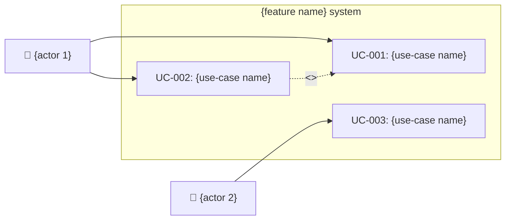
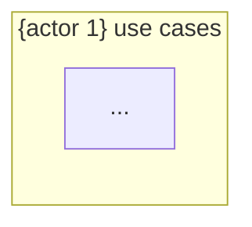
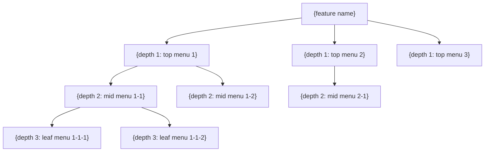
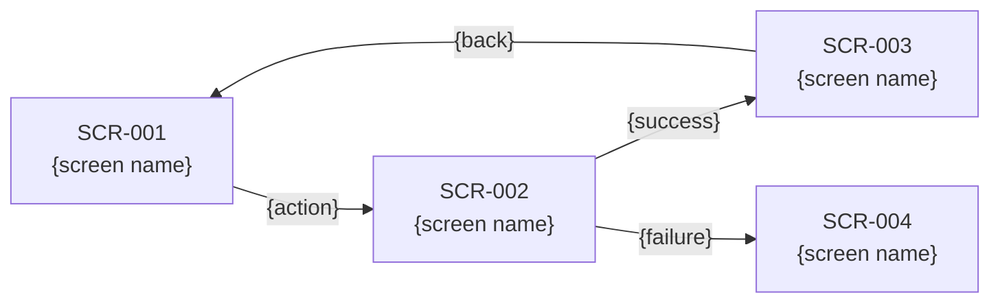

# ASTRA Service Planning Auto-Generator

Auto-generates 6 planning deliverables + HTML mockup screens for a feature, based on the Design Thinking methodology.

**Methodology mapping**:
- **Empathize**: market / competitor analysis + persona interviews
- **Define**: pain-point analysis + JTBD + requirements definition
- **Ideate**: HMW + SCAMPER + idea derivation
- **Prototype**: IA structure + screen design + HTML mockup screens + feature definition

**Deliverables**:
1. `market-analysis.md` — market / competitor analysis report
2. `interview-report.md` — persona interview report (includes pain points)
3. `requirements-definition.md` — requirements definition (includes KPI/OKR + JTBD)
4. `usecase-definition.md` — use case definition (includes diagrams + customer journey map)
5. `ia-screen-design.md` — IA structure and screen design (includes wireframes)
6. **HTML mockup screen set** — `index.html` + `styles.css` + `SCR-NNN.html` (static mockups with design-token application, responsive / dark mode)
7. `feature-definition.md` — feature definition (includes story map + risks + policies)

**Output location**: `docs/planner/{NNN}-{feature-name}/` (6 markdowns + the HTML set all live in the same directory)

> **🌐 LANGUAGE RULE**: Before executing this skill, read the project's `CLAUDE.md` and check the `## Language` section to detect the project language. If the project language is NOT Korean (`ko`), you MUST translate ALL user-facing output — including prompts, messages, generated document content, section headers, table headers, and descriptions — into the project language. Technical identifiers (tool names, file paths, command names, DB table/column names) remain untranslated. If no `CLAUDE.md` exists or no `## Language` section is found, default to Korean.

## Behavioral principle: Think Before Coding (think first, write second)

The 6 planning deliverables determine the development direction for months to come. An assumption error at the first stage therefore costs the most. Apply the following principles throughout planning:

- **Make assumptions explicit**: write down important assumptions (feature scope, user definition, business model, technical constraints) in the deliverables, especially the "Preconditions" section of `requirements-definition.md`.
- **If multiple interpretations exist, present them all**: do not silently pick a single interpretation (e.g., B2C subscription payments) for an ambiguous feature description ("payment system"). Present interpretation options to the user via `AskUserQuestion`.
- **When unclear, stop and ask**: even during step-by-step deliverable generation, if a decisive assumption is unclear, immediately confirm with the user. This is far cheaper than authoring the 6 deliverables on the wrong persona / actor / priority and discarding them.
- **Push back when a simpler approach is visible**: if the user requests an overly complex feature scope, suggest "How about including only X in the MVP and splitting Y into a later sprint?"

> Source: [forrestchang/andrej-karpathy-skills](https://github.com/forrestchang/andrej-karpathy-skills) (MIT)

## Procedure

### Step 0: Preparation and context collection

#### A. Parse feature info

Inspect `$ARGUMENTS`:

| Argument form | Behavior |
|---------------|----------|
| Feature description string (e.g., `auth feature`, `payment system`) | Proceed based on the description. If ambiguous, confirm the interpretation in A.1. |
| _(none)_ | Ask for the feature info via `AskUserQuestion` |

##### A.1: Ambiguity validation (Think Before Coding)

If the feature description matches any of the following, do not silently pick a single interpretation; instead, present interpretation options to the user via `AskUserQuestion`:

- **Generic keywords**: "payment system", "auth", "admin page" — keywords admitting multiple interpretations (B2C/B2B, one-off/subscription, social/email, etc.)
- **Unknown target**: when it is unclear who the feature is for (general user vs. operator vs. external partner)
- **Unknown scope**: when MVP vs. full-stack is ambiguous

Example question:
```
You entered "payment system". Which interpretation is closest?

(a) B2C one-off payments (single-product purchases)
(b) B2C subscription payments (monthly/yearly recurring)
(c) B2B invoice payments (invoice + post-pay)
(d) Unified multi-payment platform combining (a)–(c)

Choice:
```

For clear inputs (e.g., "B2C subscription payments, TossPayments integration"), skip this step.

If there are no arguments, ask:

```
## Generate service planning deliverables

Please describe the feature or service you want to plan.

Examples:
- "Member-auth system including social login"
- "Subscription-based payment system"
- "Team-collaboration workspace management"

Feature description:
```

Save the user's input as `{FEATURE_DESCRIPTION}`.

#### B. Choose planning mode

Choose the planning mode via `AskUserQuestion`:

```
## Choose planning mode

Which type of planning will you run?

1. 🆕 New service planning — plan a new feature / service from scratch
2. 🔄 Improve an existing service — analyze and derive improvements for a running service

Choice:
```

- On **new service planning**: proceed with the default workflow as-is
- On **improve an existing service**: collect additional context:

```
## Improve an existing service — additional info

Please share existing data about the current service.
(If none, enter "none")

You can provide:
- user feedback / review data (file path or text)
- usage analytics (DAU, churn rate, conversion, etc.)
- top 10 CS inquiry types
- existing service URL or screen-capture path
- previous improvement history

Input:
```

Save the collected info as `{EXISTING_SERVICE_DATA}` and reflect it in persona interviews and market analysis in later steps.

#### C. Analyze the target project

Analyze the following in the current working directory:

1. Read `CLAUDE.md` — verify project overview, tech stack, domain context
2. Scan `docs/planner/` — determine existing planning-deliverable numbering (decide the next)
3. Scan `docs/blueprints/` — check potential linkage with existing blueprints

#### D. Determine the directory number

Scan the `docs/planner/` directory to verify existing numbering and decide the next number.

```
NNN = (max existing number) + 1, or 001 if none
```

Derive an English directory name from the feature description (e.g., `auth feature` → `auth`, `payment system` → `payment`).

`{OUTPUT_DIR}` = `docs/planner/{NNN}-{feature-name}/`

Confirm the directory name via `AskUserQuestion`:

```
## Confirm deliverables directory

Deliverables save path: {OUTPUT_DIR}

Proceed with this path? If you need a change, enter the desired directory name.
(e.g., 001-auth, 002-payment)
```

#### E. Switch to the dev branch and sync to latest

Before creating deliverable files, switch to `dev` and sync to latest. Do not create a work branch; work directly on `dev`. Work-branch creation is handled automatically when `/pr-merge` runs.

0. **Main-worktree guard**: if called from inside an isolated worktree (`.astra-worktrees/<slug>/`), abort. dev-sync runs only in the main worktree:
   ```bash
   PLUGIN_ROOT="${CLAUDE_PLUGIN_ROOT:-$(ls -d ~/.claude/plugins/cache/*/astra-methodology/* 2>/dev/null | sort -V | tail -1)}"
   if [ -z "$PLUGIN_ROOT" ] || [ ! -f "$PLUGIN_ROOT/scripts/worktree-helpers.sh" ]; then
     echo "ERROR: CLAUDE_PLUGIN_ROOT not found. Check the plugin cache path." >&2
     exit 1
   fi
   source "$PLUGIN_ROOT/scripts/worktree-helpers.sh"
   astra_ensure_main_worktree || exit 1
   ```
1. **Check the current branch**: `git branch --show-current`
2. **Skip if already on `dev`**: if the current branch is `dev`, skip steps 3–5 below and just pull (`git pull origin dev`)
3. **Preserve uncommitted changes**: check with `git status --porcelain`; if changes exist, stash temporarily via `git stash --include-untracked` (untracked files included)
4. **Switch to dev and sync**: `git fetch origin dev && git checkout dev && git pull origin dev`
5. **Restore stash**: if you stashed in step 3, restore via `git stash pop`. On conflict, report the conflicting files to the user and request manual resolution.

> **Note**: if the `dev` branch does not exist, work on `main` or `master`. If no default branch exists, work on the current branch.

---

### Step 1: Generate the market / competitor analysis report

#### A. Market-environment analysis

Based on `{FEATURE_DESCRIPTION}` and the project context, analyze the following:

1. **PEST analysis**: Political, Economic, Social, Technological factors
2. **Market size and trends**: market trends, growth, key changes in the domain
3. **Target market**: target customer base, market segments

> **Improve-existing-service mode**: if `{EXISTING_SERVICE_DATA}` is present, also analyze the current service's positioning and market position.

#### B. Competitor benchmarking

Select 3–5 similar services / products and benchmark:

- Direct competitors (services offering the same feature)
- Indirect competitors (services solving a similar problem in another way)
- Global references (overseas exemplars)

#### C. SWOT analysis

Derive the project's Strengths, Weaknesses, Opportunities, and Threats.

#### D. Author the market-analysis report

Generate `{OUTPUT_DIR}/market-analysis.md`:

```markdown
# Market / competitor analysis — {feature name}

## 1. Overview

| Item | Content |
|------|---------|
| Feature | {FEATURE_DESCRIPTION} |
| Analysis date | {today's date} |
| Planning mode | {new service planning / improve existing service} |

## 2. Market-environment analysis (PEST)

| Factor | Analysis | Implications |
|--------|----------|--------------|
| Political/Legal (P) | {related regulations, policies, legal trends} | {impact on planning} |
| Economic (E) | {market size, growth rate, economic trends} | {impact on planning} |
| Social/Cultural (S) | {user-behavior shifts, demographic trends} | {impact on planning} |
| Technological (T) | {tech evolution, platform shifts, AI / automation trends} | {impact on planning} |

## 3. Competitor benchmarking

### 3.1 Competitive landscape

| # | Service | Type | Key features | Target | Pricing model |
|---|---------|------|--------------|--------|---------------|
| 1 | {service} | Direct competitor | {features} | {target} | {model} |
| 2 | {service} | Indirect competitor | {features} | {target} | {model} |
| 3 | {service} | Global reference | {features} | {target} | {model} |

### 3.2 Feature comparison matrix

| Feature | Our service | Competitor A | Competitor B | Competitor C |
|---------|-------------|--------------|--------------|--------------|
| {core feature 1} | {O/X/△} | {O/X/△} | {O/X/△} | {O/X/△} |
| {core feature 2} | {O/X/△} | {O/X/△} | {O/X/△} | {O/X/△} |
| {core feature 3} | {O/X/△} | {O/X/△} | {O/X/△} | {O/X/△} |

### 3.3 Differentiators

| # | Differentiator | Description | Competitive-advantage level |
|---|----------------|-------------|------------------------------|
| 1 | {element} | {description} | strong / medium / weak |

## 4. SWOT analysis

| | Positive | Negative |
|---|----------|----------|
| **Internal** | **Strengths (S)** | **Weaknesses (W)** |
| | - {strength 1} | - {weakness 1} |
| | - {strength 2} | - {weakness 2} |
| **External** | **Opportunities (O)** | **Threats (T)** |
| | - {opportunity 1} | - {threat 1} |
| | - {opportunity 2} | - {threat 2} |

### 4.1 SO/ST/WO/WT strategy derivation

| Strategy | Description |
|----------|-------------|
| SO strategy (Strengths × Opportunities) | {strategy that uses strengths to capture opportunities} |
| ST strategy (Strengths × Threats) | {strategy that uses strengths to counter threats} |
| WO strategy (Weaknesses × Opportunities) | {strategy that compensates weaknesses to exploit opportunities} |
| WT strategy (Weaknesses × Threats) | {strategy that minimizes weaknesses and threats} |

## 5. Market implications and planning direction

| # | Implication | Planning reflection | Priority |
|---|-------------|---------------------|----------|
| 1 | {implication} | {reflection direction} | high/med/low |
| 2 | {implication} | {reflection direction} | high/med/low |
```

> **Important**: after authoring the market-analysis report, confirm with the user: "The market-analysis report has been generated. Proceed to the next step (actor derivation)?"

---

### Step 2: Actor derivation and selection

#### A. Auto-derive actors

Synthesize `{FEATURE_DESCRIPTION}` and the market-analysis result to derive related actors (user types).

Derivation criteria:
- **Direct users**: subjects who directly use the service (general user, subscriber, buyer, etc.)
- **Administrators**: subjects who manage / operate the service (system admin, operator, content manager, etc.)
- **Indirect users**: subjects who interact indirectly (partner, API consumer, external system, etc.)
- **Stakeholders**: subjects who care about the outcome (execs, marketers, etc.)

Derive at least 3 and at most 8 actors.

#### B. Multi-select actors

Show the derived actor list to the user and request multi-select via `AskUserQuestion`:

```
## Select actors (user types)

Below is the actor list derived for "{FEATURE_DESCRIPTION}".
Select actors to interview (comma-separate for multi-select).

| # | Actor | Type | Description |
|---|-------|------|-------------|
| 1 | General user | Direct user | end user who uses the service directly |
| 2 | System admin | Administrator | operator managing the service |
| 3 | ... | ... | ... |

Actor numbers to select (e.g., 1,2,3):
```

Save the selected actors as the `{SELECTED_ACTORS}` array.

> **Note**: if the user wants to add an actor, accept the additional actor as input and include it in the list.

---

### Step 3: Run persona interviews and generate the interview report

#### A. Generate personas per actor

Generate **3 personas** per selected actor.

Each persona includes:

| Item | Description |
|------|-------------|
| Name | a name (e.g., Min-su Kim) |
| Age | range 25–55 |
| Occupation | typical occupation for the actor |
| Tech literacy | beginner / intermediate / advanced |
| Usage context | mobile / desktop / hybrid |
| Core goal | the main purpose of using the service |
| Frustrations | dissatisfactions from prior experiences |
| Traits | usage patterns, dispositions, and other differentiators |

Personas must reflect diverse backgrounds and perspectives (distribute age range, tech literacy, usage purposes).

> **Improve-existing-service mode**: reflect real user feedback / CS data from `{EXISTING_SERVICE_DATA}` in the personas' frustrations and interview answers.

#### B. Run persona interviews

Simulate a **deep interview** for each persona.

Interview question categories (3–5 questions per category; 15–20 total):

1. **Current experience (As-Is)**
   - How do you currently perform tasks related to this feature?
   - What tools / methods do you use?
   - Which task takes the most time?

2. **Pain points**
   - What is the most painful?
   - Where do mistakes happen most often?
   - At what point do you give up?

3. **Needs & expectations**
   - What would the ideal experience look like?
   - What would you like automated?
   - What good experiences have you had in other services?

4. **Value & priority**
   - Which feature is most important?
   - Among time-saving vs. cost-saving vs. convenience, what is the priority?
   - Which feature would you pay for?

Each persona's responses must be **realistic answers reflecting that persona's traits**.

#### C. Comprehensive pain-point analysis

Analyze all interview results and produce:

1. **Per-actor core pain points** — 5 pain points commonly observed for each actor type
2. **Interest keywords** — 5 keywords representing each actor's core interests
3. **Task analysis** — score each major task on a 5-point scale for importance / time / frequency
4. **Overall integrated pain points** — Top 10 most severe pain points across all actors

#### D. Author the interview report

Generate `{OUTPUT_DIR}/interview-report.md`:

```markdown
# Interview report — {feature name}

## 1. Overview

| Item | Content |
|------|---------|
| Feature | {FEATURE_DESCRIPTION} |
| Interview date | {today's date} |
| Actors interviewed | {selected actor list} |
| Number of personas | {actor count × 3} |

## 2. Persona profiles

### 2.1 {actor 1}

#### Persona 1: {name} ({age}, {occupation})
| Item | Content |
|------|---------|
| Tech literacy | {beginner / intermediate / advanced} |
| Usage context | {mobile / desktop / hybrid} |
| Core goal | {goal} |
| Frustrations | {frustrations} |
| Traits | {traits} |

(repeat the same format for persona 2, 3)

### 2.2 {actor 2}
(same format)

## 3. Interview details

### 3.1 {actor 1}

#### Persona 1: {name}

| # | Question | Answer |
|---|----------|--------|
| 1 | {question} | {answer} |
| 2 | {question} | {answer} |
| ... | ... | ... |

(repeat for every persona)

## 4. Pain-point analysis

### 4.1 Per-actor core pain points

#### {actor 1}
| # | Pain point | Severity (1-5) | Frequency (1-5) | Scope of impact |
|---|------------|----------------|------------------|------------------|
| 1 | {pain point} | {score} | {score} | {scope} |
| ... | ... | ... | ... | ... |

### 4.2 Per-actor interest keywords

| Actor | Keyword 1 | Keyword 2 | Keyword 3 | Keyword 4 | Keyword 5 |
|-------|-----------|-----------|-----------|-----------|-----------|

### 4.3 Task analysis

| # | Task | Importance | Time | Frequency | Core pain point |
|---|------|------------|------|-----------|------------------|

### 4.4 Top 10 overall integrated pain points

| PP-ID | Rank | Pain point | Related actor | Severity | Resolution priority |
|-------|------|------------|----------------|----------|---------------------|
| PP-001 | 1 | {pain point} | {actor} | {score} | {high/med/low} |
| PP-002 | 2 | {pain point} | {actor} | {score} | {high/med/low} |
| ... | ... | ... | ... | ... | ... |
```

> **Important**: after authoring the interview report, confirm with the user: "The interview report has been generated. Proceed to the next step (idea derivation)?"

---

### Step 4: Idea derivation and requirements-definition generation

#### A. Idea derivation

Based on the interview report's **Top 10 integrated pain points** and the market-analysis report's **planning direction**, derive solution ideas.

Idea-derivation techniques:
- **HMW (How Might We)**: convert each pain point into "How might we …?"
- **SCAMPER**: Substitute, Combine, Adapt, Modify, Put to other use, Eliminate, Reverse
- **JTBD (Jobs-to-be-Done)**: write a Job Statement for each core pain point:
  - Form: "**When** [context], **I want to** [motivation/action], **so I can** [expected outcome]"
  - Identify currently underserved needs per JTBD and reflect them in ideas
- **Tech application**: include technical solutions — AI / automation / UX improvements, etc.

> **Improve-existing-service mode**: when `{EXISTING_SERVICE_DATA}` is present, author JTBD / HMW based on real usage data (churn points, CS-inquiry types, frequency of use) and back idea priority with empirical evidence.

Derive at least 10 and at most 15 ideas.

#### B. Pick ideas

Show the derived ideas and request multi-select via `AskUserQuestion`:

```
## Select solution ideas

Ideas derived from interview pain points + market analysis.
Pick ideas to implement (comma-separate for multi-select).

| # | JTBD | HMW question | Idea | Description | Pain points addressed | Implementation difficulty | Expected impact |
|---|------|--------------|------|-------------|------------------------|---------------------------|-----------------|
| 1 | When..., I want to..., so I can... | How might we ...? | {idea} | {description} | PP-{N} | high/med/low | high/med/low |
| 2 | ... | ... | ... | ... | ... | ... | ... |

Idea numbers to select (e.g., 1,3,5,7):
```

Save the selected ideas as the `{SELECTED_IDEAS}` array.

#### C. Author the requirements definition

Based on the selected ideas, generate `{OUTPUT_DIR}/requirements-definition.md`:

```markdown
# Requirements definition — {feature name}

## 1. Overview

| Item | Content |
|------|---------|
| Feature | {FEATURE_DESCRIPTION} |
| Authored | {today's date} |
| Base documents | market-analysis.md, interview-report.md |
| Selected ideas | {N} |

## 2. Success metrics (KPI / OKR)

### 2.1 Business objectives

| # | Objective | Description | Related strategy |
|---|-----------|-------------|------------------|
| O1 | {objective} | {description} | {refer to SWOT strategy} |
| O2 | {objective} | {description} | {refer to SWOT strategy} |

### 2.2 Key results

| # | Parent objective | Key result | Current | Target | Measurement |
|---|------------------|------------|---------|--------|-------------|
| KR1 | O1 | {measurable result} | {baseline or N/A} | {target} | {method} |
| KR2 | O1 | {measurable result} | {baseline or N/A} | {target} | {method} |
| KR3 | O2 | {measurable result} | {baseline or N/A} | {target} | {method} |

### 2.3 KPI dashboard items

| # | KPI | Description | Cadence | Target threshold | Related KR |
|---|-----|-------------|---------|-------------------|------------|
| 1 | {KPI} | {description} | daily/weekly/monthly | {threshold} | KR{N} |

## 3. JTBD (Jobs-to-be-Done) summary

| # | Job Statement | Related pain points | Current resolution | Expected resolution | Related ideas |
|---|---------------|----------------------|---------------------|---------------------|----------------|
| J1 | When {context}, I want to {motivation}, so I can {outcome} | PP-{N} | {1-5} | {1-5} | IDEA-{N} |
| J2 | When {context}, I want to {motivation}, so I can {outcome} | PP-{N} | {1-5} | {1-5} | IDEA-{N} |

## 4. Functional requirements

### FR-001: {requirement title}

| Item | Content |
|------|---------|
| ID | FR-001 |
| Name | {title} |
| Description | {detailed description} |
| Related idea | IDEA-{N} |
| Related pain point | PP-{N} |
| Related JTBD | J{N} |
| Related actors | {actor list} |
| Priority | Must / Should / Could |
| Acceptance criteria | {acceptance criteria list} |
| Related KPI | {KPI} |

(repeat for every requirement)

## 5. Non-functional requirements

### NFR-001: {requirement title}

| Item | Content |
|------|---------|
| ID | NFR-001 |
| Type | performance / security / usability / accessibility / compatibility |
| Name | {title} |
| Description | {detailed description} |
| Measurement criterion | {measurable criterion} |
| Priority | Must / Should / Could |

## 6. Requirements traceability matrix

| Req ID | Name | Pain point | JTBD | Idea | Actor | KPI | Priority |
|--------|------|------------|------|------|-------|-----|----------|
| FR-001 | {title} | PP-{N} | J{N} | IDEA-{N} | {actor} | {KPI} | {priority} |
| ... | ... | ... | ... | ... | ... | ... | ... |
```

> **Important**: after authoring the requirements definition, confirm with the user: "The requirements definition has been generated. Proceed to the next step (use-case definition)?"

---

### Step 5: Generate the use-case definition

Define use cases per actor, based on the interview report and the requirements definition.

#### A. Use-case derivation

For each selected actor, map requirements to use cases:

- One requirement may correspond to 1+ use cases
- Identify relationships among use cases: `<<include>>`, `<<extend>>`, generalization

#### B. Derive customer journey maps

For core use cases (3–5), author customer journey maps:

Components:
- **Phase**: time-ordered service touchpoints (Awareness → Exploration → Sign-up → Use → Re-visit)
- **Action**: the user's actions per phase
- **Touchpoint**: the channel / screen where the user meets the service
- **Emotion**: the user's emotional state per phase (😊 positive / 😐 neutral / 😤 negative)
- **Pain point**: inconveniences at each phase
- **Opportunity area**: points where improvement is possible

#### C. Author the use-case definition

Generate `{OUTPUT_DIR}/usecase-definition.md`:

~~~markdown
# Use-case definition — {feature name}

## 1. Overview

| Item | Content |
|------|---------|
| Feature | {FEATURE_DESCRIPTION} |
| Authored | {today's date} |
| Base documents | interview-report.md, requirements-definition.md |
| Actor count | {N} |
| Use-case count | {N} |

## 2. Actor definitions

| # | Actor | Type | Description | Related use cases |
|---|-------|------|-------------|--------------------|
| 1 | {actor} | {direct / admin / indirect / system} | {description} | UC-001, UC-002, ... |

## 3. Customer Journey Map

### 3.1 {core use-case / scenario name} — {primary actor}

```mermaid
journey
    title {scenario name}
    section {phase 1: awareness / exploration}
      {action 1}: {emotion score 1-5}: {actor}
      {action 2}: {emotion score 1-5}: {actor}
    section {phase 2: sign-up / setup}
      {action 3}: {emotion score 1-5}: {actor}
      {action 4}: {emotion score 1-5}: {actor}
    section {phase 3: core use}
      {action 5}: {emotion score 1-5}: {actor}
    section {phase 4: result / re-visit}
      {action 6}: {emotion score 1-5}: {actor}
```

**Journey details**:

| Phase | Action | Touchpoint | Emotion | Pain point | Opportunity |
|-------|--------|------------|---------|------------|-------------|
| {phase 1} | {action} | {screen / channel} | {😊/😐/😤} | {inconvenience} | {improvement} |
| {phase 2} | {action} | {screen / channel} | {😊/😐/😤} | {inconvenience} | {improvement} |

(repeat for 3–5 core use cases)

## 4. Use-case diagram (Mermaid)

### 4.1 System-wide use-case diagram



### 4.2 {actor 1} use-case diagram



(diagram per actor)

## 5. Use-case details

### UC-001: {use-case name}

| Item | Content |
|------|---------|
| ID | UC-001 |
| Name | {title} |
| Primary actor | {actor} |
| Secondary actor | {actor or none} |
| Precondition | {precondition} |
| Postcondition | {state on success} |
| Related requirements | FR-001, FR-002 |
| Related JTBD | J{N} |
| Priority | high / medium / low |

**Main flow:**

| Step | Actor | System |
|------|-------|--------|
| 1 | {actor action} | |
| 2 | | {system response} |
| 3 | {actor action} | |
| 4 | | {system response} |

**Alternative flow:**

| Branch point | Condition | Flow |
|--------------|-----------|------|
| Step 2 | {condition} | {alternative flow} |

**Exception flow:**

| Branch point | Exception | Handling |
|--------------|-----------|----------|
| Step 2 | {exception} | {handling} |

(repeat for every use case)

## 6. Use-case relationship matrix

| Use case | Relationship | Target use case | Description |
|----------|--------------|------------------|-------------|
| UC-001 | <<include>> | UC-003 | {description} |
| UC-002 | <<extend>> | UC-001 | {description} |

## 7. Requirements ↔ use-case traceability matrix

| Req ID | Use-case ID | Coverage |
|--------|--------------|----------|
| FR-001 | UC-001, UC-002 | full |
| FR-002 | UC-003 | partial |
~~~

> **Important**: after authoring the use-case definition, confirm with the user: "The use-case definition has been generated. Proceed to the next step (IA structure and screen design)?"

---

### Step 6: IA structure and screen design + HTML mockup-screen generation

Based on the use-case and requirements definitions, design the information architecture (IA) and author both the wireframes (markdown) of major screens and the static HTML mockups with design-token application. Flow: A→D (markdown authoring) → E (design system / tone decision) → F (HTML generation).

#### A. IA (Information Architecture) design

Based on the feature definition and use cases, design the overall menu structure:

- **Depth 1**: top menu (GNB)
- **Depth 2**: mid menu (LNB or tabs)
- **Depth 3**: leaf menu (detail pages)

Map related use cases and requirements to each menu item.

> **Improve-existing-service mode**: start from the current service's IA and mark only changed / added menu items separately (e.g., `[NEW]`, `[CHANGED]`). For existing screens, only the parts that need changes are written as wireframes.

#### B. Screen flow

For major user scenarios (based on the main flows of the use cases), author the screen-transition paths as Mermaid flowcharts.

#### C. Text-based wireframes

Author ASCII-based wireframes for core screens (3–5):

- Layout structure (header, sidebar, content, footer)
- Major UI element placement (button, input field, table, card, etc.)
- Functional description of each element

#### D. Author the IA structure and screen-design report

Generate `{OUTPUT_DIR}/ia-screen-design.md`:

~~~markdown
# IA structure and screen design — {feature name}

## 1. Overview

| Item | Content |
|------|---------|
| Feature | {FEATURE_DESCRIPTION} |
| Authored | {today's date} |
| Base documents | requirements-definition.md, usecase-definition.md |
| Total screens | {N} |

## 2. IA (information architecture)

### 2.1 Menu tree



### 2.2 IA details

| Depth | Menu ID | Menu name | Screen ID | Description | Related UC | Related FR | Access |
|-------|---------|-----------|-----------|-------------|-------------|-------------|--------|
| 1 | M1 | {top menu 1} | — | {description} | — | — | {permission} |
| 2 | M1-1 | {mid menu 1-1} | SCR-001 | {description} | UC-001 | FR-001 | {permission} |
| 3 | M1-1-1 | {leaf menu 1-1-1} | SCR-002 | {description} | UC-001 | FR-001 | {permission} |

## 3. Screen flow

### 3.1 {scenario name} flow



(repeat for 2–3 major scenarios)

## 4. Screen list

| Screen ID | Screen name | Type | Related UC | Related FR | Description |
|-----------|-------------|------|-------------|-------------|-------------|
| SCR-001 | {screen name} | list / detail / form / modal / dashboard | UC-001 | FR-001 | {description} |
| SCR-002 | {screen name} | {type} | UC-002 | FR-002 | {description} |

## 5. Wireframes

### SCR-001: {screen name}

**Screen description**: {purpose and main functions of the screen}
**Related UC**: UC-001 | **Related FR**: FR-001, FR-002

```
┌─────────────────────────────────────────────┐
│  [Logo]          {service name}    [👤 Profile] │
├─────────────────────────────────────────────┤
│ ┌─────┐  ┌─────────────────────────────────┐│
│ │     │  │  📋 {section title}              ││
│ │ Menu│  │                                 ││
│ │     │  │  ┌──────────────────────────┐    ││
│ │ • A │  │  │ {data area}              │    ││
│ │ • B │  │  │                          │    ││
│ │ • C │  │  │  [item 1]  [item 2]       │    ││
│ │     │  │  │  [item 3]  [item 4]       │    ││
│ │     │  │  └──────────────────────────┘    ││
│ │     │  │                                 ││
│ │     │  │  [+ Add]          [Save] [Cancel]││
│ └─────┘  └─────────────────────────────────┘│
├─────────────────────────────────────────────┤
│  © {service name}  |  Terms  |  Privacy      │
└─────────────────────────────────────────────┘
```

**UI-element descriptions**:

| # | Element | Type | Description | Behavior |
|---|---------|------|-------------|----------|
| 1 | {element} | button / input / table / ... | {description} | {behavior on click / input} |
| 2 | {element} | {type} | {description} | {behavior} |

(repeat for 3–5 core screens)

## 6. Screen ↔ use-case ↔ requirement traceability

| Screen ID | Screen name | Use case | Requirements | Actor |
|-----------|-------------|----------|--------------|-------|
| SCR-001 | {screen name} | UC-001 | FR-001, FR-002 | {actor} |
~~~

#### E. Load the design system and auto-decide the design tone

Decide the design tokens and design tone to use for HTML mockup generation.

##### E.1 Load the design system SSoT

Determine the design-system source in the following priority order (v5.2.0+ DESIGN.md prioritized):

| Priority | Path | Use when | Extract |
|----------|------|----------|---------|
| 1 | `docs/design-system/DESIGN.md` | SSoT exists | Front Matter tokens + Body §1 philosophy + §2 persona + §5 aesthetic_rules |
| 2 | `src/styles/design-tokens.css` | DESIGN.md absent + only CSS exists (legacy project) | CSS variable list |
| 3 | `$CLAUDE_PLUGIN_ROOT/skills/project-init/templates/DESIGN.md` | the project has no design system at all (right after Sprint 0, etc.) | template defaults |

**If DESIGN.md is loaded**: parse the Front Matter YAML to extract available tokens such as `tokens.color.semantic.*`, `tokens.typography.scale`, `tokens.spacing.scale`. Body §5 `aesthetic_rules.forbidden_generic_patterns` is used as an exclusion rule during HTML generation. Body §2 persona is used when deciding the tone of dummy data.

**If only CSS is loaded** (legacy): token extraction is the same but aesthetic_rules / persona info is absent. Print a Recommended note about running `/design-init` for the user, and proceed.

##### E.2 Load component / layout guides (optional)

When DESIGN.md is loaded, Body §4 is the component-spec SSoT (no separate load needed).

Only for legacy projects without DESIGN.md, load the following:

- `docs/design-system/components.md` — specs for buttons / inputs / cards, etc.
- `docs/design-system/layout-grid.md` — grid / breakpoint system

##### E.3 Load the Vibe Coding guides (required)

Load `$CLAUDE_PLUGIN_ROOT/docs/ux/vibe-coding-design-guide.md` (Anti-AI aesthetics, reference anchoring) and `$CLAUDE_PLUGIN_ROOT/docs/ux/vibe-coding-animation-guide.md` (spring easing, micro-interactions). On absence, print a warning and proceed without the guides.

##### E.4 Auto-decide the design tone ({DESIGN_TONE})

**If DESIGN.md exists**: `brand.personality` + `brand.target_persona` in the Front Matter already defines the tone, so skip the separate auto-decision. When generating HTML, apply the DESIGN.md tone as-is.

**If DESIGN.md does not exist**: do not ask the user; synthesize the feature description + market analysis + persona info and auto-select one of the following (`AskUserQuestion` is forbidden). Note the rationale (one line) in an HTML file comment.

| Design tone | Suitable domains |
|-------------|------------------|
| Refined Minimal | SaaS, productivity tools, admin dashboards |
| Bold & Vibrant | consumer apps, marketing, campaign pages |
| Soft & Warm | community, education, healthcare |
| Editorial | content, media, commerce curation |
| Professional Enterprise | B2B, finance, public / enterprise |

#### F. Generate HTML mockup screens (design-token-applied static mockups)

**Purpose**: complement the text wireframes by providing visual mockups the user can verify in the browser immediately. Not production components — **static HTML/CSS mockups** that are high-fidelity wireframes with design tokens applied.

**Core principles**:
- Use only static HTML/CSS (no JS framework / bundler needed; opens directly in the browser)
- Use design tokens 100% (no hardcoded colors/sizes; `var(--*)` or fallback values)
- Auto-support for responsive (mobile/tablet/desktop) + dark mode (`prefers-color-scheme`)
- Implement micro-interactions (hover/focus/active) with CSS only
- Dummy data is natural content based on persona info
- No AI-image generation (inefficient at the planning stage) — icons are inline SVG or CSS gradients

##### F.1 Output location

**All HTML/CSS files are created directly in the same directory as the markdown deliverables (`{OUTPUT_DIR}/`)**. Do not create a separate subfolder.

```
{OUTPUT_DIR}/
├── market-analysis.md
├── interview-report.md
├── requirements-definition.md
├── usecase-definition.md
├── ia-screen-design.md
├── feature-definition.md            # generated in Step 7
├── styles.css                       # shared styles (design tokens + components + animation)
├── index.html                       # screen index (navigation hub)
├── SCR-001.html                     # per-screen static HTML mockup
├── SCR-002.html
└── ...
```

##### F.2 Generate shared styles (styles.css)

Generate `{OUTPUT_DIR}/styles.css` with the following structure:

1. **`:root` design tokens** — define the tokens loaded in Step E.1 as-is (fill missing items with fallback tokens)
2. **Dark-mode token override** — `@media (prefers-color-scheme: dark) :root { ... }`
3. **CSS Reset** — `box-sizing: border-box`, reset margin / padding
4. **Base typography** — body font, heading scale, line-height
5. **Layout utilities** — `.container` (responsive max-width), `.grid-N` (12-column), breakpoints (mobile-first)
6. **Component styles** — styled to match `{DESIGN_TONE}`:
   - `.btn` (primary/secondary/ghost) + hover/focus/active/disabled
   - `.input` + floating label, focus ring
   - `.card` (default/elevated/interactive) + hover lift
   - `.gnb`, `.sidebar`, `.page-layout`
   - `.table`, `.modal`, `.toast`, `.badge`, `.skeleton`
7. **Animation** — spring-easing variables, fadeInUp/shimmer keyframes
8. **Accessibility** — `:focus-visible` focus ring, `prefers-reduced-motion` handling
9. **Print styles** (optional) — `@media print` defaults

##### F.3 Generate per-screen HTML (`SCR-NNN.html`)

Based on Section 4 (screen list) + Section 5 (wireframes) of `ia-screen-design.md`, **generate a separate HTML file per SCR-NNN listed**.

Structure of each `SCR-NNN.html`:

```html
<!doctype html>
<html lang="en">
<head>
  <meta charset="utf-8" />
  <meta name="viewport" content="width=device-width, initial-scale=1" />
  <title>SCR-NNN — {screen name} | {feature name}</title>
  <!--
    Screen ID: SCR-NNN
    Related UC: UC-XXX
    Related FR: FR-XXX
    Design tone: {DESIGN_TONE}
    Tone rationale: {one-line rationale}
  -->
  <link rel="stylesheet" href="styles.css" />
</head>
<body>
  <header class="gnb"> ... </header>          <!-- when needed -->
  <aside class="sidebar"> ... </aside>         <!-- when needed -->
  <main class="page-content">
    <!-- implement the UI elements from the wireframe in semantic HTML -->
  </main>
  <footer> ... </footer>                       <!-- when needed -->
  <a href="index.html" class="back-to-index">← All screens</a>
</body>
</html>
```

Generation rules:

| Rule | Content |
|------|---------|
| Semantic HTML | use `header`, `nav`, `main`, `section`, `article`, `aside`, `footer` |
| Design tokens | all colors/sizes/spacing are `var(--*)` only (no hardcoding) |
| Responsive | support mobile (<768px) / tablet (768-1023px) / desktop (≥1024px) |
| Dark mode | auto-supported via the token overrides in styles.css (no extra work) |
| Accessibility | `aria-*` attributes, `alt` text, focus management, sufficient contrast, 44px touch targets |
| Dummy data | natural content using persona names/traits from the interview report |
| Disabled interactions | never write `onclick` on `<button>`/links (static mockup) — use `href="#"` or `disabled` |
| Icons | inline SVG or CSS pseudo-elements. No external font / image dependencies |
| Cross-page navigation | provide a "← All screens" link at top/bottom returning to `index.html` |

##### F.4 Generate the screen index (`index.html`)

Generate a navigation hub showing all SCR-NNN screens at a glance.

```html
<!doctype html>
<html lang="en">
<head>
  <meta charset="utf-8" />
  <meta name="viewport" content="width=device-width, initial-scale=1" />
  <title>{feature name} mockup index</title>
  <link rel="stylesheet" href="styles.css" />
</head>
<body>
  <header class="page-header">
    <h1>{feature name} mockups</h1>
    <p class="meta">Design tone: {DESIGN_TONE} · Screens: {N} · Authored: {YYYY-MM-DD}</p>
  </header>
  <main class="screen-grid">
    <!-- each screen as a card -->
    <a href="SCR-001.html" class="screen-card">
      <div class="screen-card__id">SCR-001</div>
      <div class="screen-card__title">{screen name}</div>
      <div class="screen-card__type">{type}</div>
      <div class="screen-card__meta">UC-XXX · FR-XXX</div>
    </a>
    ...
  </main>
  <footer class="legend">
    <p>Related docs: <a href="ia-screen-design.md">ia-screen-design.md</a> · <a href="feature-definition.md">feature-definition.md</a></p>
  </footer>
</body>
</html>
```

##### F.5 Augment the IA / screen-design report

Add an HTML-preview guidance section to the body of `ia-screen-design.md` (at the end of Section 6 or as its own section):

```markdown
## 7. HTML mockup preview

Open `index.html` in a browser to visually verify every screen.

| Screen ID | HTML file | Screen name |
|-----------|-----------|-------------|
| SCR-001 | [SCR-001.html](SCR-001.html) | {screen name} |
| SCR-002 | [SCR-002.html](SCR-002.html) | {screen name} |
| ... | ... | ... |

- Design tone: **{DESIGN_TONE}** ({one-line selection rationale})
- Design-token source: `{token path}`
- Responsive: mobile / tablet / desktop
- Dark mode: auto-switch via `prefers-color-scheme`
```

> **Important**: after both the IA/screen-design report and the HTML mockups (`index.html`, `styles.css`, `SCR-NNN.html`) are generated, confirm with the user: "The IA/screen-design report and HTML mockups have been generated. You can open `{OUTPUT_DIR}/index.html` in the browser to check. Proceed to the next step (feature definition)?"

---

### Step 7: Generate the feature definition

Synthesize the interview report, requirements definition, use-case definition, and IA/screen-design report to author the final feature definition.

#### A. Feature structuring

Structure features based on requirements and use cases:
- **Feature Group**: top category
- **Feature**: implementation unit
- **Sub-feature**: detailed behavior

#### B. User Story Mapping

Rearrange features as a User Story Map to visualize the MVP scope:
- **User Activity** (row): the user's big activity unit (corresponds to a Feature Group)
- **User Task** (row): specific tasks within an activity (corresponds to a Feature)
- **User Story** (column): detail stories of a task (corresponds to a Sub-feature)
- **Release Slice**: horizontal division by release (MVP / v1.1 / v1.2)

> **Improve-existing-service mode**: in the feature tree, distinguish between existing and new/changed features (e.g., `[NEW]`, `[CHANGED]`, `[AS-IS]`). In the User Story Map, place only the changes included in the current release in the MVP slice.

#### C. Author the feature definition

Generate `{OUTPUT_DIR}/feature-definition.md`:

~~~markdown
# Feature definition — {feature name}

## 1. Overview

| Item | Content |
|------|---------|
| Feature | {FEATURE_DESCRIPTION} |
| Authored | {today's date} |
| Base documents | market-analysis.md, interview-report.md, requirements-definition.md, usecase-definition.md, ia-screen-design.md |
| Feature Groups | {N} |
| Features | {N} |
| Sub-features | {N} |

## 2. Feature structure

### 2.1 Feature tree

```
{feature name}
├── FG-01: {Feature Group 1}
│   ├── FT-01-01: {Feature 1}
│   │   ├── SF-01-01-01: {Sub-feature 1}
│   │   └── SF-01-01-02: {Sub-feature 2}
│   └── FT-01-02: {Feature 2}
│       ├── SF-01-02-01: {Sub-feature 1}
│       └── SF-01-02-02: {Sub-feature 2}
├── FG-02: {Feature Group 2}
│   └── ...
```

## 3. User Story Map

### 3.1 Story-map view

```
┌─────────────────────────────────────────────────────────────────────┐
│ User          │ {Activity 1}       │ {Activity 2}       │ ...      │
│ Activities    │ (FG-01)            │ (FG-02)            │          │
├───────────────┼────────────────────┼────────────────────┼──────────┤
│ User          │ {Task 1-1}         │ {Task 2-1}         │          │
│ Tasks         │ {Task 1-2}         │ {Task 2-2}         │          │
├═══════════════╪════════════════════╪════════════════════╪══════════┤
│ MVP           │ • {Story 1-1-1}    │ • {Story 2-1-1}    │          │
│ (Release 1)   │ • {Story 1-2-1}    │                    │          │
├───────────────┼────────────────────┼────────────────────┼──────────┤
│ v1.1          │ • {Story 1-1-2}    │ • {Story 2-1-2}    │          │
│ (Release 2)   │                    │ • {Story 2-2-1}    │          │
├───────────────┼────────────────────┼────────────────────┼──────────┤
│ v1.2          │ • {Story 1-2-2}    │ • {Story 2-2-2}    │          │
│ (Release 3)   │                    │                    │          │
└───────────────┴────────────────────┴────────────────────┴──────────┘
```

### 3.2 Release-scope definition

| Release | Included features | Goal | Expected sub-feature count |
|---------|--------------------|------|-----------------------------|
| MVP (Release 1) | {core features list} | {minimum value delivery} | {N} |
| v1.1 (Release 2) | {additional features list} | {usability improvements} | {N} |
| v1.2 (Release 3) | {extended features list} | {sophistication} | {N} |

## 4. Feature details

### FG-01: {Feature Group name}

#### FT-01-01: {Feature name}

| Item | Content |
|------|---------|
| Feature ID | FT-01-01 |
| Name | {Feature name} |
| Description | {feature description} |
| Related requirements | FR-001, FR-002 |
| Related use cases | UC-001 |
| Related screens | SCR-001, SCR-002 |
| Related actors | {actor list} |
| Related KPI | {KPI} |
| Priority | Must / Should / Could |
| Implementation difficulty | high / medium / low |
| Release | MVP / v1.1 / v1.2 |

**Sub-feature list:**

| # | ID | Sub-feature | Description | Input | Output | Business rule / policy | Priority |
|---|----|-------------|-------------|-------|--------|--------------------------|----------|
| 1 | SF-01-01-01 | {sub-feature} | {description} | {input data} | {output data} | {business rule and service policy} | {priority} |
| 2 | SF-01-01-02 | {sub-feature} | {description} | {input data} | {output data} | {business rule and service policy} | {priority} |

(repeat for every Feature Group / Feature)

## 5. Service policy

### 5.1 Service-operation policy

| # | Policy item | Policy content | Related features | Notes |
|---|-------------|----------------|------------------|-------|
| 1 | {policy item} | {concrete policy} | FT-{N} | {notes} |
| 2 | {policy item} | {concrete policy} | FT-{N} | {notes} |

### 5.2 Data-handling policy

| # | Data item | Retention | Processing | Related features |
|---|-----------|-----------|-------------|--------------------|
| 1 | {data} | {duration} | {encryption / masking / deletion, etc.} | FT-{N} |

### 5.3 Exception-handling policy

| # | Exception | Handling | User-facing message | Related features |
|---|-----------|----------|----------------------|--------------------|
| 1 | {exception} | {handling} | {message} | FT-{N} |

## 6. Feature priority matrix (MoSCoW)

| Priority | Feature ID | Feature | Rationale |
|----------|------------|---------|-----------|
| **Must** | FT-01-01 | {Feature} | {rationale} |
| **Should** | FT-01-02 | {Feature} | {rationale} |
| **Could** | FT-02-01 | {Feature} | {rationale} |
| **Won't** | - | - | {reason for exclusion from this scope} |

## 7. Risk analysis

### 7.1 Risk register

| # | Risk ID | Risk | Type | Likelihood (1-5) | Impact (1-5) | Risk score | Response strategy |
|---|---------|------|------|-------------------|---------------|------------|--------------------|
| 1 | RSK-001 | {risk} | tech / schedule / resource / external | {score} | {score} | {likelihood × impact} | {avoid / transfer / mitigate / accept} |
| 2 | RSK-002 | {risk} | {type} | {score} | {score} | {score} | {strategy} |

### 7.2 Response plan

| Risk ID | Response strategy | Concrete actions | Owner | Trigger condition |
|---------|--------------------|-------------------|-------|--------------------|
| RSK-001 | {strategy} | {concrete actions} | {owner} | {when to start the response} |

### 7.3 Constraints

| # | Constraint type | Content | Affected features | Alternatives |
|---|-----------------|---------|---------------------|---------------|
| 1 | Technical | {constraint} | FT-{N} | {alternative} |
| 2 | Business | {constraint} | FT-{N} | {alternative} |

## 8. Feature ↔ requirement ↔ use-case ↔ screen integrated traceability matrix

| Feature ID | Feature | Requirement | JTBD | Use case | Screen | Actor | Pain point | KPI | Priority | Release |
|------------|---------|--------------|------|----------|--------|-------|------------|-----|----------|---------|
| FT-01-01 | {Feature} | FR-001 | J1 | UC-001 | SCR-001 | {actor} | PP-{N} | {KPI} | Must | MVP |
| ... | ... | ... | ... | ... | ... | ... | ... | ... | ... | ... |
~~~

> **Important**: after authoring the feature definition, confirm with the user: "The feature definition has been generated. Print the final completion report?"

---

### Step 8: Completion report

When every deliverable is generated, report the result to the user:

```
## Planning deliverables generation complete

📁 Deliverables location: {OUTPUT_DIR}

| # | Deliverable | File | Status |
|---|-------------|------|--------|
| 1 | Market / competitor analysis | market-analysis.md | ✅ done |
| 2 | Interview report | interview-report.md | ✅ done |
| 3 | Requirements definition | requirements-definition.md | ✅ done |
| 4 | Use-case definition | usecase-definition.md | ✅ done |
| 5 | IA / screen-design report | ia-screen-design.md | ✅ done |
| 6 | HTML mockup index | index.html | ✅ done |
| 7 | Shared styles | styles.css | ✅ done |
| 8 | Per-screen HTML mockups | SCR-001.html ~ SCR-{N}.html | ✅ done ({N}) |
| 9 | Feature definition | feature-definition.md | ✅ done |

▶︎ Open `{OUTPUT_DIR}/index.html` in your browser to view the HTML mockups.

### Summary
- Planning mode: {new service planning / improve existing service}
- Analyzed actors: {N} types, {N × 3} personas
- Market / competitor analysis: {N} competitors, {N} SWOT strategies
- Derived pain points: {N}
- Derived JTBDs: {N}
- Adopted ideas: {N}
- Defined KPIs: {N} (OKRs: {N})
- Defined requirements: functional {N} + non-functional {N}
- Defined use cases: {N}
- Customer journey maps: {N}
- IA menu items: {N}
- Wireframes: {N} screens (markdown + HTML)
- HTML mockups: {N} SCR-NNN.html (design tone {DESIGN_TONE} applied, responsive + dark mode)
- Defined features: Feature Groups {N}, Features {N}, Sub-features {N}
- User Story Map: MVP {N}, v1.1 {N}, v1.2 {N}
- Risks: {N} identified
- Service policies: {N} defined

Next, run `/project-init` (initial project setup) or author a blueprint (`docs/blueprints/{NNN}-{feature}/blueprint.md`). For long-running features that need designer/QA collaboration, you can additionally generate a Screen-ID-based collaboration package via `/handoff-publish`.
```
