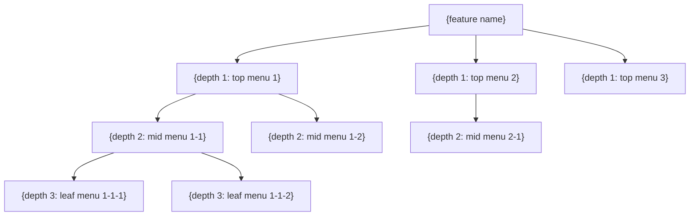
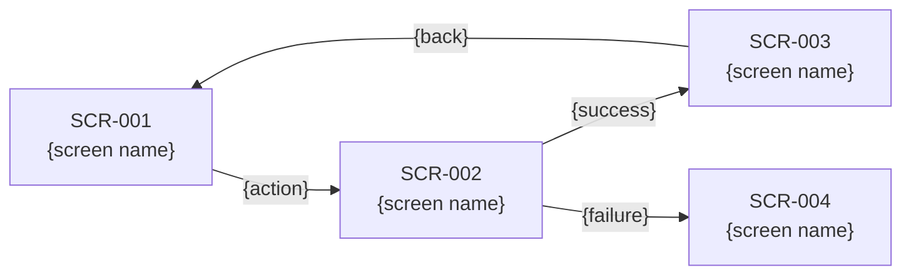

# IA Structure and Screen-Design Template

Instantiate this skeleton with the IA, screen-flow, and wireframe results, then write it to `{OUTPUT_DIR}/ia-screen-design.md`. Fill every `{...}` placeholder; keep the Mermaid blocks, ASCII wireframe, and SCR/UC/FR ID schemes intact.

## Sections in this template
- §1 Overview
- §2 IA (Mermaid menu tree + IA-details table)
- §3 Screen flow (Mermaid `flowchart LR`)
- §4 Screen list
- §5 Wireframes (ASCII layout + UI-element table)
- §6 Screen ↔ use-case ↔ requirement traceability
- (§7 HTML mockup preview — added later in Step 6.F.5; see `templates-html-mockup.md`)

~~~markdown
# IA structure and screen design — {feature name}

## 1. Overview

| Item | Content |
|------|---------|
| Feature | {FEATURE_DESCRIPTION} |
| Authored | {today's date} |
| Base documents | requirements-definition.md, usecase-definition.md |
| Total screens | {N} |

## 2. IA (information architecture)

### 2.1 Menu tree



### 2.2 IA details

| Depth | Menu ID | Menu name | Screen ID | Description | Related UC | Related FR | Access |
|-------|---------|-----------|-----------|-------------|-------------|-------------|--------|
| 1 | M1 | {top menu 1} | — | {description} | — | — | {permission} |
| 2 | M1-1 | {mid menu 1-1} | SCR-001 | {description} | UC-001 | FR-001 | {permission} |
| 3 | M1-1-1 | {leaf menu 1-1-1} | SCR-002 | {description} | UC-001 | FR-001 | {permission} |

## 3. Screen flow

### 3.1 {scenario name} flow



(repeat for 2–3 major scenarios)

## 4. Screen list

| Screen ID | Screen name | Type | Related UC | Related FR | Description |
|-----------|-------------|------|-------------|-------------|-------------|
| SCR-001 | {screen name} | list / detail / form / modal / dashboard | UC-001 | FR-001 | {description} |
| SCR-002 | {screen name} | {type} | UC-002 | FR-002 | {description} |

## 5. Wireframes

### SCR-001: {screen name}

**Screen description**: {purpose and main functions of the screen}
**Related UC**: UC-001 | **Related FR**: FR-001, FR-002

```
┌─────────────────────────────────────────────┐
│  [Logo]          {service name}    [👤 Profile] │
├─────────────────────────────────────────────┤
│ ┌─────┐  ┌─────────────────────────────────┐│
│ │     │  │  📋 {section title}              ││
│ │ Menu│  │                                 ││
│ │     │  │  ┌──────────────────────────┐    ││
│ │ • A │  │  │ {data area}              │    ││
│ │ • B │  │  │                          │    ││
│ │ • C │  │  │  [item 1]  [item 2]       │    ││
│ │     │  │  │  [item 3]  [item 4]       │    ││
│ │     │  │  └──────────────────────────┘    ││
│ │     │  │                                 ││
│ │     │  │  [+ Add]          [Save] [Cancel]││
│ └─────┘  └─────────────────────────────────┘│
├─────────────────────────────────────────────┤
│  © {service name}  |  Terms  |  Privacy      │
└─────────────────────────────────────────────┘
```

**UI-element descriptions**:

| # | Element | Type | Description | Behavior |
|---|---------|------|-------------|----------|
| 1 | {element} | button / input / table / ... | {description} | {behavior on click / input} |
| 2 | {element} | {type} | {description} | {behavior} |

(repeat for 3–5 core screens)

## 6. Screen ↔ use-case ↔ requirement traceability

| Screen ID | Screen name | Use case | Requirements | Actor |
|-----------|-------------|----------|--------------|-------|
| SCR-001 | {screen name} | UC-001 | FR-001, FR-002 | {actor} |
~~~
