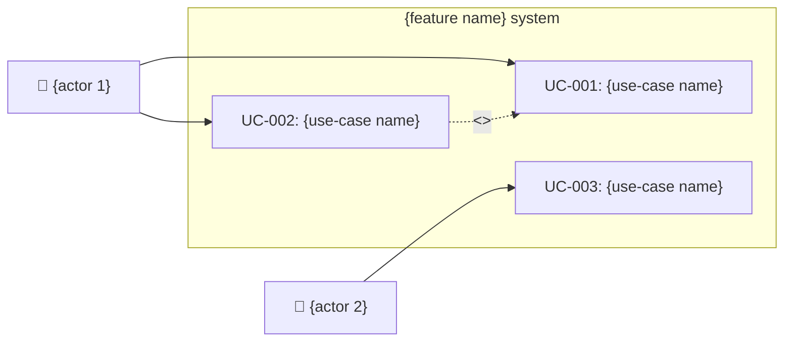
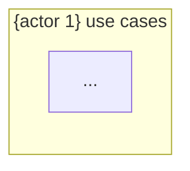

# Use-Case Definition Template

Instantiate this skeleton with the use-case and customer-journey-map results, then write it to `{OUTPUT_DIR}/usecase-definition.md`. Fill every `{...}` placeholder; keep the Mermaid blocks, ID schemes (UC/FR/J), and traceability matrices intact.

## Sections in this template
- §1 Overview
- §2 Actor definitions
- §3 Customer Journey Map (Mermaid `journey` + journey-details table)
- §4 Use-case diagram (Mermaid `graph LR`, system-wide + per-actor)
- §5 Use-case details (main / alternative / exception flows)
- §6 Use-case relationship matrix (`<<include>>` / `<<extend>>`)
- §7 Requirements ↔ use-case traceability matrix

~~~markdown
# Use-case definition — {feature name}

## 1. Overview

| Item | Content |
|------|---------|
| Feature | {FEATURE_DESCRIPTION} |
| Authored | {today's date} |
| Base documents | interview-report.md, requirements-definition.md |
| Actor count | {N} |
| Use-case count | {N} |

## 2. Actor definitions

| # | Actor | Type | Description | Related use cases |
|---|-------|------|-------------|--------------------|
| 1 | {actor} | {direct / admin / indirect / system} | {description} | UC-001, UC-002, ... |

## 3. Customer Journey Map

### 3.1 {core use-case / scenario name} — {primary actor}

```mermaid
journey
    title {scenario name}
    section {phase 1: awareness / exploration}
      {action 1}: {emotion score 1-5}: {actor}
      {action 2}: {emotion score 1-5}: {actor}
    section {phase 2: sign-up / setup}
      {action 3}: {emotion score 1-5}: {actor}
      {action 4}: {emotion score 1-5}: {actor}
    section {phase 3: core use}
      {action 5}: {emotion score 1-5}: {actor}
    section {phase 4: result / re-visit}
      {action 6}: {emotion score 1-5}: {actor}
```

**Journey details**:

| Phase | Action | Touchpoint | Emotion | Pain point | Opportunity |
|-------|--------|------------|---------|------------|-------------|
| {phase 1} | {action} | {screen / channel} | {😊/😐/😤} | {inconvenience} | {improvement} |
| {phase 2} | {action} | {screen / channel} | {😊/😐/😤} | {inconvenience} | {improvement} |

(repeat for 3–5 core use cases)

## 4. Use-case diagram (Mermaid)

### 4.1 System-wide use-case diagram



### 4.2 {actor 1} use-case diagram



(diagram per actor)

## 5. Use-case details

### UC-001: {use-case name}

| Item | Content |
|------|---------|
| ID | UC-001 |
| Name | {title} |
| Primary actor | {actor} |
| Secondary actor | {actor or none} |
| Precondition | {precondition} |
| Postcondition | {state on success} |
| Related requirements | FR-001, FR-002 |
| Related JTBD | J{N} |
| Priority | high / medium / low |

**Main flow:**

| Step | Actor | System |
|------|-------|--------|
| 1 | {actor action} | |
| 2 | | {system response} |
| 3 | {actor action} | |
| 4 | | {system response} |

**Alternative flow:**

| Branch point | Condition | Flow |
|--------------|-----------|------|
| Step 2 | {condition} | {alternative flow} |

**Exception flow:**

| Branch point | Exception | Handling |
|--------------|-----------|----------|
| Step 2 | {exception} | {handling} |

(repeat for every use case)

## 6. Use-case relationship matrix

| Use case | Relationship | Target use case | Description |
|----------|--------------|------------------|-------------|
| UC-001 | <<include>> | UC-003 | {description} |
| UC-002 | <<extend>> | UC-001 | {description} |

## 7. Requirements ↔ use-case traceability matrix

| Req ID | Use-case ID | Coverage |
|--------|--------------|----------|
| FR-001 | UC-001, UC-002 | full |
| FR-002 | UC-003 | partial |
~~~
